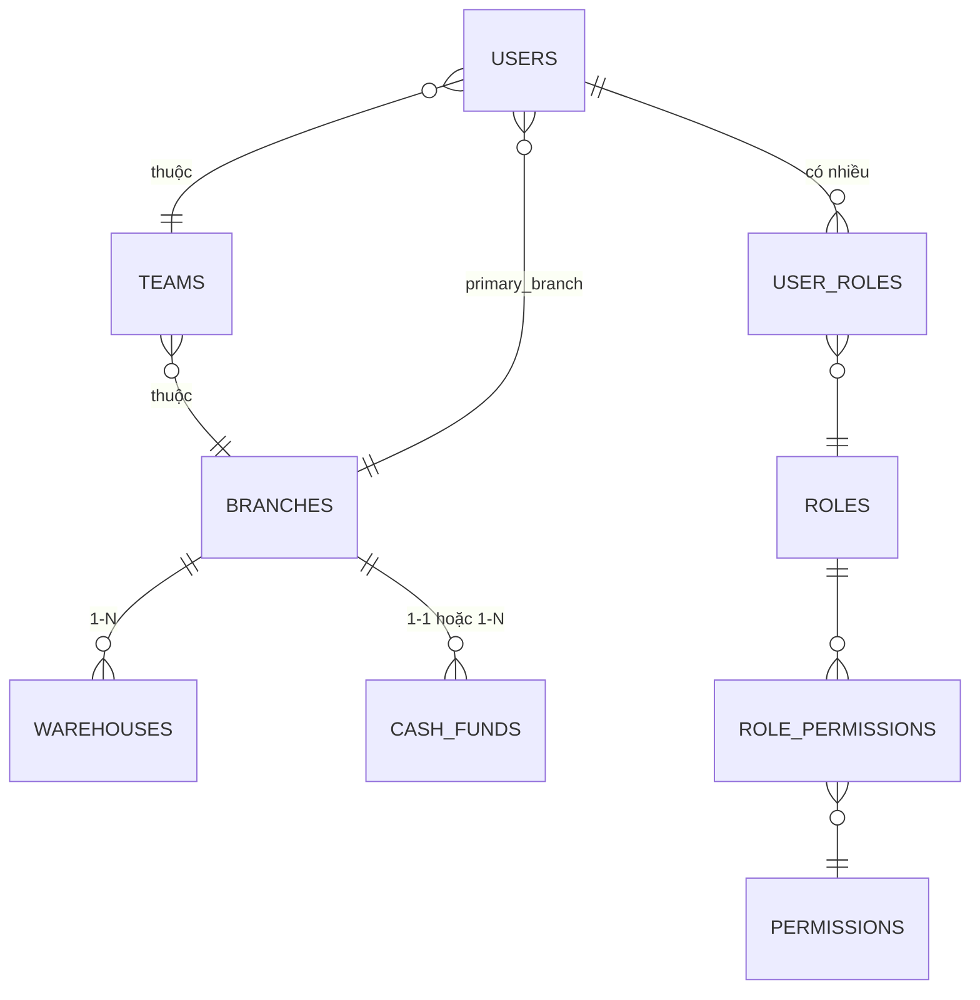
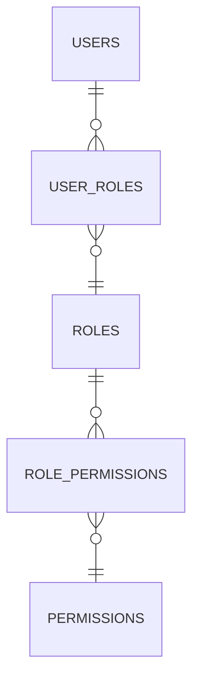
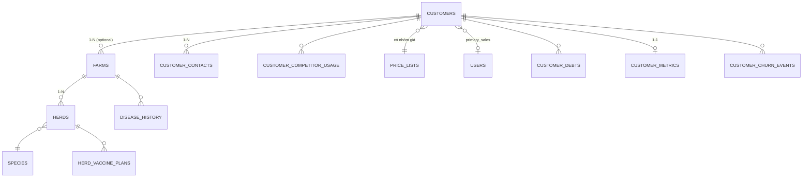
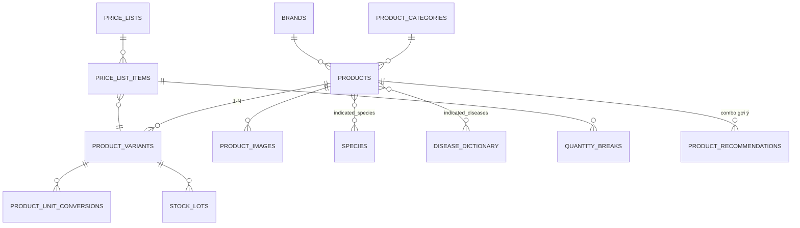
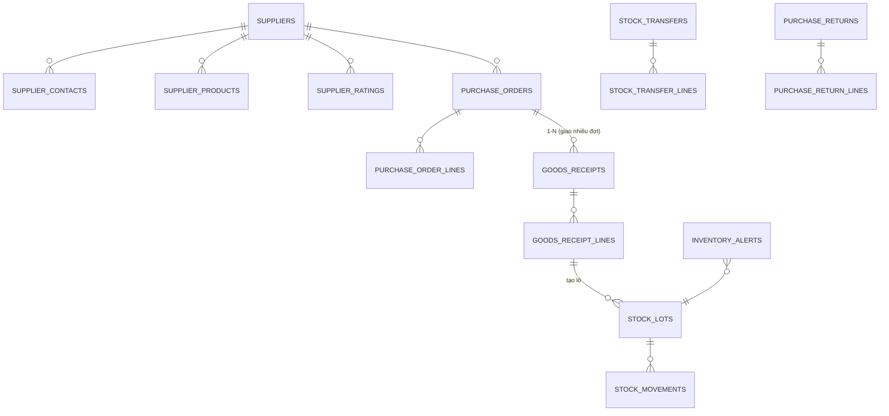
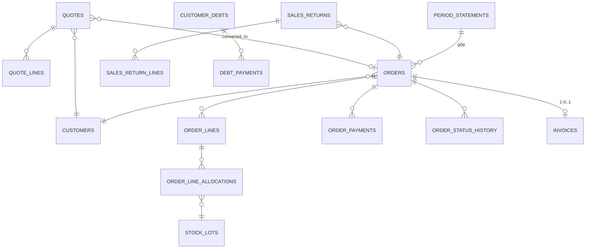
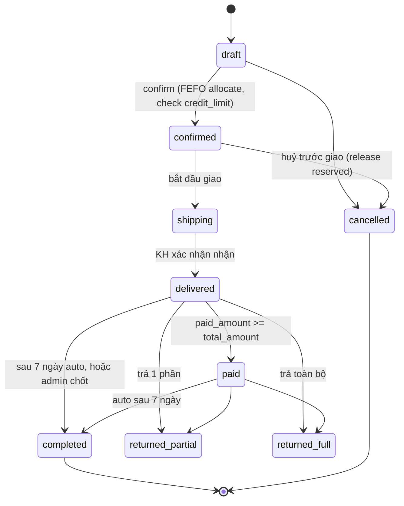
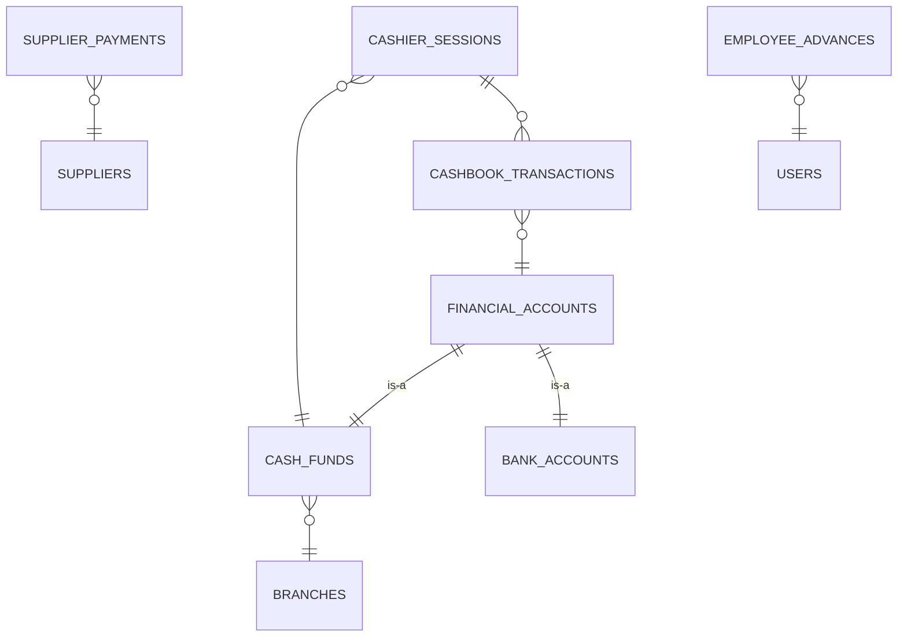
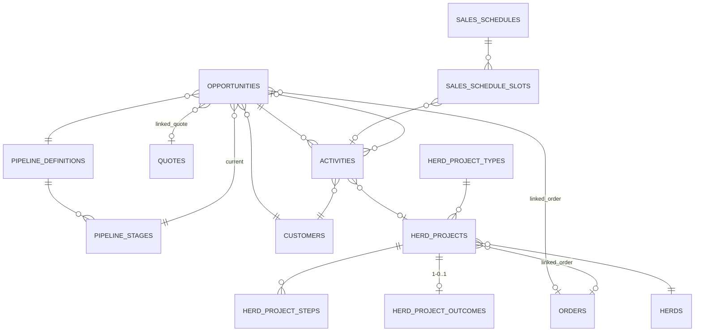
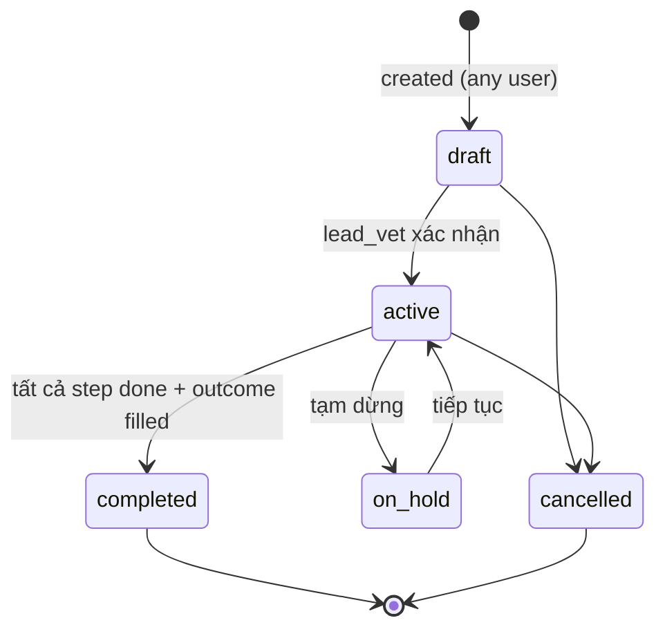

# SANH LONG CRM/ERP — FUNCTIONAL SPECIFICATION

> **Phiên bản:** 1.0 · **Ngày:** 22/05/2026 · **Trạng thái:** Draft cho Phase 1
> **Stack:** React + Vite + TypeScript / Supabase (Postgres + Auth + Storage + Edge Functions) / Vercel / Antigravity IDE
> **Đối tượng đọc:** Antigravity agent (sinh database schema, RLS, Edge Functions, frontend code) + đội phát triển con người

---

## MỤC LỤC

1. [Tổng quan & nguyên tắc](#1-tổng-quan--nguyên-tắc)
2. [Phase plan](#2-phase-plan)
3. [Kiến trúc tổ chức](#3-kiến-trúc-tổ-chức)
4. [Phân quyền (RBAC + RLS)](#4-phân-quyền-rbac--rls)
5. [Module Khách hàng](#5-module-khách-hàng)
6. [Module Sản phẩm & Giá](#6-module-sản-phẩm--giá)
7. [Module Nhà cung cấp, Nhập hàng, Kho](#7-module-nhà-cung-cấp-nhập-hàng-kho)
8. [Module Đơn hàng, POS, Hoá đơn, Trả hàng, Công nợ](#8-module-đơn-hàng-pos-hoá-đơn-trả-hàng-công-nợ)
9. [Module Sổ quỹ & Dòng tiền](#9-module-sổ-quỹ--dòng-tiền)
10. [Module Cơ hội, Hoạt động, Dự án đàn](#10-module-cơ-hội-hoạt-động-dự-án-đàn)
11. [Module Dashboard, Báo cáo, Tìm kiếm, Thông báo](#11-module-dashboard-báo-cáo-tìm-kiếm-thông-báo)
12. [Quy ước kỹ thuật chung](#12-quy-ước-kỹ-thuật-chung)
13. [Danh mục permissions](#13-danh-mục-permissions)
14. [Danh sách enum & lookup](#14-danh-sách-enum--lookup)

---

## 1. TỔNG QUAN & NGUYÊN TẮC

### 1.1. Bối cảnh

Sanh Long Vetco là doanh nghiệp phân phối thuốc thú y, vaccine, thiết bị chăn nuôi và thức ăn bổ sung tại Việt Nam. Hệ thống này phục vụ vận hành nội bộ — không phải B2C.

**Người dùng chính:** đội sales 30–55 tuổi đi thị trường, thủ kho tại chi nhánh, kế toán, bác sĩ thú y (BSTY) nội bộ, branch director, admin/CEO.

**Đặc thù ngành:**
- Thuốc/vaccine có HSD, số đăng ký lưu hành, hoạt chất, thời gian ngưng thuốc trước mổ
- Vaccine cần chuỗi lạnh
- KH là trại chăn nuôi, đại lý, doanh nghiệp lớn, BSTY phòng khám — mỗi loại có thuộc tính khác
- Sanh Long không chỉ bán SP mà còn cung cấp **dịch vụ kỹ thuật** (vaccine cho đàn, chữa bệnh khẩn cấp, tư vấn) qua module "Dự án đàn"

### 1.2. Nguyên tắc thiết kế

1. **Mobile-first cho sales, desktop-rich cho admin/kế toán.** Sales ghi đơn ở trại bằng điện thoại; admin xem báo cáo phức tạp ở văn phòng.
2. **Progressive disclosure.** Tạo nhanh KH chỉ cần 4-5 field; mở rộng thuộc tính sâu ở tab phụ.
3. **Snapshot bất biến cho mọi giao dịch.** Đơn hàng/báo giá/phiếu thu lưu snapshot customer/price/promotion tại thời điểm phát sinh — không phụ thuộc dữ liệu master sau này thay đổi.
4. **Postgres-native business logic.** Mọi atomic operation (tạo đơn + trừ kho + ghi nợ + ghi sổ quỹ) đều ở Postgres function/trigger để đảm bảo nhất quán. Edge Functions chỉ làm những việc cần Node/Deno (gọi API HD điện tử, gửi email, generate PDF).
5. **RLS chặt và đúng.** Mọi bảng có policy. Sales chỉ thấy KH cùng team. Sổ quỹ chỉ admin. Báo cáo công ty chỉ branch_director trở lên.
6. **Audit log không thoả hiệp.** Mọi thay đổi giá, chuyển KH, xoá đơn, sửa quyền — ghi vào `audit_logs`. Không có cách nào tắt.
7. **Tiếng Việt có dấu cho UI. Tiếng Anh cho code/identifier.** Search hỗ trợ tiếng Việt không dấu (extension `unaccent`).

### 1.3. Bộ giá trị về UX

- Font: Be Vietnam Pro (sans, hỗ trợ dấu VN tốt) — fallback Inter, system-ui
- Button to (44×44px min trên mobile — chuẩn touch target Apple/Google)
- Số tiền VND format có dấu chấm phân cách nghìn: `1.250.000 ₫`
- Ngày format `dd/MM/yyyy` (VN convention)
- Không dùng màu cảnh báo đỏ/vàng/xanh tô loẹt — dùng icon + label

---

## 2. PHASE PLAN

Bộ tài liệu này đặc tả **toàn bộ** hệ thống. Để build được, chia 3 phase:

### Phase 1 — ERP bán hàng tối thiểu (2-3 tháng)

Mục tiêu: vận hành được nghiệp vụ cốt lõi, doanh nghiệp dùng thay sổ Excel/giấy.

- ✓ Auth + RBAC (multi-role)
- ✓ Tổ chức (chi nhánh, kho, team)
- ✓ Sản phẩm cơ bản (1 SP = 1 variant, chưa multi-variant, chưa multi-unit)
- ✓ Lô + HSD bắt buộc, FEFO
- ✓ Khách hàng cơ bản (danh tính + nhóm giá + công nợ, chưa analytics)
- ✓ Nhập hàng (PO → goods_receipt), trả NCC
- ✓ Bảng giá theo nhóm KH (chưa quantity_break)
- ✓ POS desktop + Mobile order entry
- ✓ Báo giá → chuyển đơn
- ✓ Đơn hàng (6 trạng thái), trả hàng KH
- ✓ Công nợ KH (cả per_order và period_consolidated)
- ✓ Hoá đơn bán lẻ (chưa VAT điện tử)
- ✓ Sổ quỹ + phiên quỹ + duyệt phiếu chi
- ✓ Dashboard role-based cơ bản
- ✓ Tìm kiếm global Ctrl+K (fuzzy VN)
- ✓ Thông báo in-app + email
- ✓ Audit log

### Phase 2 — CRM đầy đủ + nâng cấp ERP (4-6 tháng)

- ✓ Multi-variant (quy cách × nồng độ × dạng) + multi-unit (chai/thùng/pallet) + quantity_break
- ✓ Điều chuyển kho liên chi nhánh
- ✓ Cảnh báo HSD, low stock, slow moving, gợi ý tái nhập
- ✓ Khách hàng đầy đủ: trại + đàn + lịch vaccine + lịch sử bệnh + nhãn cạnh tranh
- ✓ Cơ hội bán hàng (pipeline linh hoạt)
- ✓ Hoạt động + lịch tuần sales
- ✓ Dự án đàn (đầy đủ workflow)
- ✓ Khuyến mãi 6 loại + tích điểm
- ✓ VAT điện tử (tích hợp Misa/Viettel SInvoice)
- ✓ Báo cáo nâng cao (pipeline conversion, KM ROI, cross-table filter)
- ✓ Export Excel sổ quỹ theo template kế toán VN

### Phase 3 — Phân tích nâng cao & tự động hoá (6-12 tháng)

- ✓ Analytics KH: RFM, lifecycle stage, churn risk, customer score, product affinity
- ✓ Gợi ý cross-sell/up-sell/switch-from-competitor
- ✓ Dòng tiền dự kiến (cashflow forecast)
- ✓ Zalo OA / SMS notification
- ✓ IoT chuỗi lạnh (cảnh báo nhiệt độ kho lạnh)
- ✓ Đối soát sao kê ngân hàng (CSV import)
- ✓ Khoá KH tự động khi quá hạn nợ
- ✓ BigQuery export cho BI nặng

> **Quy ước trong file này:** mỗi feature/bảng có tag `[P1]`, `[P2]`, `[P3]` để biết thuộc phase nào. Antigravity build từng phase, không build tất cả cùng lúc.

---

## 3. KIẾN TRÚC TỔ CHỨC

### 3.1. Sơ đồ thực thể tổ chức



### 3.2. Branches (Chi nhánh) `[P1]`

Sanh Long có **4+ chi nhánh**, thiết kế scale từ đầu.

| Field | Type | Note |
|---|---|---|
| id | uuid PK | |
| code | text UNIQUE | vd `CN-HCM`, `CN-HN`, `CN-DN`, `CN-CT` |
| name | text | "Chi nhánh TP.HCM" |
| region | text | "Miền Nam" / "Miền Bắc" / "Miền Trung" / "Tây Nguyên" — dùng để gắn team matrix |
| address_full, city, district, ward | text | |
| phone, email | text | |
| director_user_id | uuid FK users | branch_director của chi nhánh |
| active | boolean | |
| created_at, updated_at | timestamptz | |

### 3.3. Warehouses (Kho) `[P1]`

Một chi nhánh có nhiều kho. Mỗi kho có **type** khác nhau ảnh hưởng quy tắc nghiệp vụ.

| Field | Type | Note |
|---|---|---|
| id | uuid PK | |
| code | text UNIQUE | vd `KHO-HCM-CHINH`, `KHO-HCM-LANH`, `KHO-HCM-TB` |
| name | text | |
| branch_id | uuid FK | |
| warehouse_type | enum | `main` / `cold_chain` / `equipment` / `quarantine` / `returns` |
| address | text | có thể khác chi nhánh nếu kho ở vị trí riêng |
| keeper_user_id | uuid FK users | thủ kho chính |
| temperature_range_min, _max | numeric | chỉ có nghĩa với `cold_chain` (vd 2–8°C) |
| active | boolean | |

**Quy tắc:**
- Vaccine (`products.category = 'vaccine'`) chỉ được nhập vào kho `cold_chain`
- Lô trả về (sales return quarantine) chỉ vào kho `returns` hoặc kho có quarantine area
- Khi tạo `goods_receipt`, validate variant.category vs warehouse.warehouse_type

### 3.4. Teams (Nhóm bán hàng) `[P1]`

Cơ cấu: Sales → Trưởng nhóm → Giám đốc chi nhánh → CEO.
Team chia theo **matrix Vùng × Ngành hàng**.

| Field | Type | Note |
|---|---|---|
| id | uuid PK | |
| code | text UNIQUE | vd `TEAM-MN-HEO`, `TEAM-MB-GIACAM` |
| name | text | "Team Miền Nam — Heo" |
| region | text | "Miền Nam" / etc — match với branches.region |
| product_line | text | "Heo" / "Gia cầm" / "Bò" / "Thuỷ sản" / "Đa ngành" |
| branch_id | uuid FK | chi nhánh quản team này |
| lead_user_id | uuid FK users | trưởng nhóm |
| active | boolean | |

**Quy tắc:** 1 user thuộc đúng 1 team chính (cột `users.primary_team_id`). Sales bán cho KH ở vùng/ngành khác vẫn được, không khoá.

### 3.5. Users (Nhân viên) `[P1]`

Liên kết với Supabase Auth. Mỗi user có **nhiều role** qua `user_roles`.

| Field | Type | Note |
|---|---|---|
| id | uuid PK | = `auth.users.id` |
| email | text UNIQUE | |
| full_name | text | |
| phone | text | |
| avatar_url | text | Supabase Storage |
| primary_branch_id | uuid FK | chi nhánh cơ sở |
| primary_team_id | uuid FK | team chính |
| employee_code | text UNIQUE | vd `SL-001` |
| job_title | text | "Nhân viên kinh doanh", "Bác sĩ thú y", "Thủ kho"... — text mô tả, không dùng cho quyền |
| hire_date | date | |
| active | boolean | nghỉ việc → set false, không xoá |
| last_seen_at | timestamptz | |
| created_at, updated_at | timestamptz | |

### 3.6. Việc bàn giao KH khi nhân viên nghỉ

Khi `users.active = false`:
- Tất cả KH có `primary_sales_id = user_id` → cần được chuyển. UI có wizard "Chuyển giao KH": chọn sales mới + ghi audit.
- Cơ hội đang mở → chuyển sang sales mới.
- Lịch tuần chưa thực hiện → huỷ hoặc chuyển.
- Phiếu chi pending_approval do user duyệt → escalate lên người cao hơn.

Cloud Function `handle_user_deactivation(user_id)` chạy khi user bị deactivate, thực hiện check + tạo task chuyển giao.

---

## 4. PHÂN QUYỀN (RBAC + RLS)

### 4.1. Mô hình

Multi-role: 1 user có **nhiều role**, mỗi role có **nhiều permission**. Admin tự cấu hình.



### 4.2. Roles mặc định (system, không xoá được)

| Code | Name | Description |
|---|---|---|
| `admin` | Quản trị viên | Toàn quyền |
| `ceo` | Giám đốc điều hành | Xem mọi báo cáo, không quản lý người dùng |
| `branch_director` | Giám đốc chi nhánh | Quản chi nhánh mình |
| `team_lead` | Trưởng nhóm | Quản team mình |
| `sales` | Nhân viên kinh doanh | Bán hàng, chăm sóc KH |
| `vet` | Bác sĩ thú y / Kỹ thuật | Làm dự án đàn |
| `warehouse_keeper` | Thủ kho | Thao tác kho |
| `accountant` | Kế toán | Sổ quỹ, công nợ, hoá đơn |
| `purchaser` | Mua hàng | PO, NCC |

Admin có thể tạo **custom role** (vd "Sales kiêm Thủ kho miền Trung") bằng cách clone 1 role có sẵn + chỉnh permission.

### 4.3. Permissions

Format `<resource>.<action>`. Xem [Danh mục permissions](#13-danh-mục-permissions) ở cuối file (~80 permissions).

Ví dụ:
- `customer.view_team` — xem KH cùng team
- `customer.view_branch` — xem KH cùng chi nhánh
- `customer.view_all` — xem mọi KH
- `customer.create`, `customer.edit_own`, `customer.delete`
- `customer.transfer_owner` — chuyển KH cho sales khác
- `order.create`, `order.confirm`, `order.cancel_after_confirmed`
- `order.override_credit_limit` — vượt hạn mức công nợ khi tạo đơn
- `cashbook.create_inflow`, `cashbook.create_outflow`, `cashbook.approve_outflow`, `cashbook.view_reports`

### 4.4. RLS strategy

Mọi bảng có RLS bật. Pattern chung:

```sql
-- Hàm helper trong schema public
CREATE FUNCTION auth_user_has_permission(perm text) RETURNS boolean
LANGUAGE sql STABLE AS $$
  SELECT EXISTS (
    SELECT 1 FROM user_roles ur
    JOIN role_permissions rp ON rp.role_id = ur.role_id
    JOIN permissions p ON p.id = rp.permission_id
    WHERE ur.user_id = auth.uid() AND p.code = perm
  );
$$;

CREATE FUNCTION auth_user_team_id() RETURNS uuid
LANGUAGE sql STABLE AS $$
  SELECT primary_team_id FROM users WHERE id = auth.uid();
$$;

CREATE FUNCTION auth_user_branch_id() RETURNS uuid
LANGUAGE sql STABLE AS $$
  SELECT primary_branch_id FROM users WHERE id = auth.uid();
$$;
```

RLS ví dụ trên bảng `customers`:

```sql
CREATE POLICY customer_select ON customers FOR SELECT USING (
  auth_user_has_permission('customer.view_all')
  OR (
    auth_user_has_permission('customer.view_branch')
    AND EXISTS (
      SELECT 1 FROM orders o WHERE o.customer_id = customers.id
        AND o.branch_id = auth_user_branch_id()
    )
  )
  OR (
    auth_user_has_permission('customer.view_team')
    AND primary_sales_id IN (
      SELECT id FROM users WHERE primary_team_id = auth_user_team_id()
    )
  )
);
```

> **Lưu ý:** RLS policy phức tạp → performance. Đánh index trên foreign key (`primary_sales_id`, `branch_id`). Test với pgbench trên 100k rows trước khi production.

### 4.5. Visibility — KH

- **Sales:** thấy KH cùng team (tất cả sales trong team mình)
- **Team_lead:** thấy KH cùng team + được override sales của team
- **Branch_director:** thấy KH chi nhánh mình (qua orders)
- **CEO/Admin:** thấy hết

### 4.6. Visibility — Sổ quỹ (chặt nhất)

- **Sales/Team_lead:** chỉ thấy phiếu thu/chi do **chính mình tạo**
- **Warehouse_keeper:** chỉ thấy phiếu trong phiên quỹ mình mở
- **Accountant:** thấy tất cả phiếu trong chi nhánh mình
- **Admin/CEO:** thấy tất cả + xem được báo cáo dòng tiền

---

## 5. MODULE KHÁCH HÀNG

### 5.1. Triết lý

Đây là module phức tạp nhất. Chia 3 tầng: **Customer → Farms → Herds**. Tạo nhanh chỉ cần Customer; Farms/Herds nhập sau khi sales có thông tin.

### 5.2. Sơ đồ thực thể



### 5.3. Bảng `customers` `[P1]`

| Field | Type | Note |
|---|---|---|
| id | uuid PK | |
| code | text UNIQUE | auto `KH-2026-00001` hoặc admin/sales nhập tay (sau khi set thì khoá) |
| name | text | tên KH / tên trại / tên DN |
| customer_type | enum | `farm_household` / `farm_commercial` / `dealer` / `enterprise` / `vet_clinic` / `other` |
| phone_primary | text | bắt buộc |
| email | text | optional |
| address_full, province, district, ward | text | bắt buộc province + district |
| location_lat, location_lng | numeric | tọa độ GPS để sales ghé thăm — optional |
| primary_sales_id | uuid FK users | sales phụ trách chính, nullable nếu chưa gán |
| price_list_id | uuid FK | nhóm giá — **bắt buộc** |
| payment_term_days | int | default lấy theo price_list, override được |
| credit_limit | numeric | hạn mức công nợ — bắt buộc, default 0 (= bán tiền mặt) |
| billing_mode | enum | `per_order` / `period_consolidated` — chế độ đáo hạn công nợ |
| period_type, period_close_day | enum, int | chỉ khi `period_consolidated` |
| wants_vat_invoice | boolean | có yêu cầu xuất HD VAT không (default theo customer_type) |
| note | text | ghi chú tự do |
| tags[] | text[] | tag mềm cho sales đánh dấu nội bộ |
| active | boolean | |
| created_by, updated_by | uuid FK users | |
| created_at, updated_at | timestamptz | |

### 5.4. Bảng `customer_business_info` `[P1]` (1-1 với customers, chỉ tạo khi cần)

Cho `enterprise`, `dealer`, hoặc `vet_clinic` có MST.

| Field | Type | Note |
|---|---|---|
| customer_id | uuid PK FK | |
| tax_code | text | MST |
| legal_name | text | tên pháp nhân chính thức |
| legal_address | text | địa chỉ xuất HD |
| legal_representative_name | text | người đại diện |
| legal_representative_id | text | CCCD/căn cước người đại diện |
| bank_name, bank_account, bank_holder | text | TK ngân hàng để thu công nợ |

### 5.5. Bảng `customer_personal_info` `[P1]` (1-1 với customers, cho KH cá nhân)

Cho `farm_household` hoặc cá nhân.

| Field | Type | Note |
|---|---|---|
| customer_id | uuid PK FK | |
| national_id | text | CCCD |
| date_of_birth | date | để gửi chúc mừng |
| spouse_name | text | tên vợ/chồng nếu liên quan kinh doanh |

### 5.6. Bảng `customer_contacts` `[P1]`

1 KH có N người liên hệ.

| Field | Type | Note |
|---|---|---|
| id | uuid PK | |
| customer_id | uuid FK | |
| full_name | text | |
| role | enum | `owner` / `technical` / `accountant` / `purchaser` / `other` |
| phone | text | |
| email, zalo_id | text | |
| date_of_birth | date | gửi chúc mừng sinh nhật |
| is_primary | boolean | 1 contact chính per KH |
| note | text | |

### 5.7. Bảng `farms` `[P2]`

Trại vật lý của KH (có thể nhập sau).

| Field | Type | Note |
|---|---|---|
| id | uuid PK | |
| code | text | auto `TRAI-<customer_code>-01` |
| customer_id | uuid FK | |
| name | text | "Trại Anh Tuấn (Bình Dương)" |
| address_full, province, district, ward | text | |
| location_lat, location_lng | numeric | |
| housing_system | enum | `open` / `closed` / `cold_climate` / `mixed` |
| breeding_source | text | "Tự nuôi" / "Mua ngoài" / "Đối tác" |
| output_buyer | text | "Lò mổ" / "Thương lái" / "Xuất khẩu" / "Tự bán" |
| competitor_feed_brand | text | nhãn thức ăn cạnh tranh đang dùng |
| note | text | |
| active | boolean | |

### 5.8. Bảng `species` `[P2]` (lookup, admin quản lý)

| Field | Type | Note |
|---|---|---|
| id | uuid PK | |
| code | text UNIQUE | `pig`, `chicken`, `cow`, `aqua`, `pet`, `other` |
| name_vi | text | "Heo", "Gà", "Bò"... |
| sub_types[] | text[] | ["nái", "thịt", "con"] / ["thịt", "đẻ", "vịt", "ngan", "cút"] |
| display_order | int | |
| active | boolean | |

### 5.9. Bảng `herds` `[P2]`

Đàn vật nuôi trong trại. **Model nhẹ** — chỉ snapshot ước lượng, không track chính xác từng lứa.

| Field | Type | Note |
|---|---|---|
| id | uuid PK | |
| code | text | auto |
| farm_id | uuid FK | |
| species_id | uuid FK | |
| sub_type | text | "nái", "thịt", "đẻ" — match với species.sub_types |
| estimated_size | int | số con ước lượng |
| estimated_size_updated_at | timestamptz | |
| breeding_purpose | text | "thương phẩm", "giống", "sữa", "trứng" |
| note | text | |
| active | boolean | (false khi đàn xuất chuồng) |

### 5.10. Bảng `vaccine_protocols` `[P2]` (template do admin/BSTY tạo)

Lịch chuẩn cho 1 loại đàn cụ thể, dùng lại nhiều lần.

| Field | Type | Note |
|---|---|---|
| id | uuid PK | |
| name | text | "Vaccine heo thịt 5 tháng" |
| species_id, sub_type | uuid, text | |
| description | text | |
| created_by | uuid FK | BSTY tạo |
| active | boolean | |

Subtable `vaccine_protocol_items`:

| Field | Type | Note |
|---|---|---|
| id | uuid PK | |
| protocol_id | uuid FK | |
| order_index | int | thứ tự mũi |
| day_offset | int | ngày thứ N tính từ ngày bắt đầu lứa (vd day 7, day 14) |
| product_id | uuid FK products | vaccine cụ thể |
| dose_description | text | "1ml/con, tiêm dưới da" |
| note | text | |

### 5.11. Bảng `herd_vaccine_plans` `[P2]`

Lịch áp dụng cho 1 đàn cụ thể. Có thể copy từ protocol hoặc tạo from-scratch.

| Field | Type | Note |
|---|---|---|
| id | uuid PK | |
| herd_id | uuid FK | |
| source_protocol_id | uuid FK | nullable nếu tạo tay |
| start_date | date | ngày bắt đầu lứa |
| status | enum | `draft` / `active` / `completed` / `cancelled` |
| created_by | uuid FK | |

Subtable `herd_vaccine_plan_items`:

| Field | Type | Note |
|---|---|---|
| id | uuid PK | |
| plan_id | uuid FK | |
| order_index | int | |
| product_id | uuid FK | |
| scheduled_date | date | = start_date + day_offset |
| actual_date | date | nullable, fill khi đã tiêm |
| executed_by_user_id | uuid FK | nullable |
| executed_in_herd_project_id | uuid FK | link đến dự án đàn thực hiện |
| dose_description | text | |
| status | enum | `pending` / `done` / `skipped` / `failed` |
| note | text | |

### 5.12. Bảng `disease_dictionary` `[P2]` (lookup chung)

Dùng cho cả "bệnh chỉ định của SP" và "lịch sử bệnh của trại".

| Field | Type | Note |
|---|---|---|
| id | uuid PK | |
| code | text UNIQUE | `swine_flu`, `newcastle`, `prrs`... |
| name_vi | text | "Cúm heo" |
| name_en | text | |
| applicable_species[] | uuid[] | species có thể mắc |
| severity_level | enum | `mild` / `moderate` / `severe` / `epidemic` |
| description | text | |

### 5.13. Bảng `disease_history` `[P2]`

Lịch sử bệnh của trại/đàn.

| Field | Type | Note |
|---|---|---|
| id | uuid PK | |
| farm_id | uuid FK | |
| herd_id | uuid FK | nullable nếu cả trại |
| disease_name | text | text tự do (autocomplete từ `disease_dictionary` + lịch sử) |
| dictionary_disease_id | uuid FK | nullable nếu match với dictionary |
| start_date, end_date | date | end nullable nếu đang diễn ra |
| severity | enum | `mild` / `moderate` / `severe` |
| mortality_count | int | số chết |
| affected_count | int | số nhiễm |
| treatment_used | text | thuốc đã dùng |
| outcome | text | kết quả |
| attachments[] | text[] | URLs |
| reported_by | uuid FK users | |
| note | text | |

### 5.14. Bảng `competitors` `[P2]` (lookup)

| Field | Type | Note |
|---|---|---|
| id | uuid PK | |
| name | text | "Bayer", "Boehringer", "Vemedim"... |
| product_categories[] | uuid[] | category SP đối thủ mạnh |
| country | text | |
| note | text | |
| active | boolean | |

### 5.15. Bảng `customer_competitor_usage` `[P2]`

KH đang dùng SP đối thủ nào.

| Field | Type | Note |
|---|---|---|
| id | uuid PK | |
| customer_id, farm_id | uuid FK | farm optional |
| competitor_id | uuid FK | |
| product_category_id | uuid FK | |
| product_name_observed | text | tên SP cụ thể sales thấy ở trại |
| usage_level | enum | `primary` / `secondary` / `trial` |
| reported_by | uuid FK | sales ghi nhận |
| last_seen_date | date | |
| note | text | |

### 5.16. Bảng `churn_reasons` `[P2]` (lookup)

| Field | Type | Note |
|---|---|---|
| id | uuid PK | |
| code | text UNIQUE | `price`, `quality`, `competitor`, `stopped_farming`, `disease`, `service`, `unreachable`, `other` |
| label_vi | text | |
| active | boolean | |

### 5.17. Bảng `customer_churn_events` `[P2]`

Lưu lịch sử churn (KH có thể churn → quay lại → churn lần nữa).

| Field | Type | Note |
|---|---|---|
| id | uuid PK | |
| customer_id | uuid FK | |
| churned_at | timestamptz | |
| churn_reason_id | uuid FK | bắt buộc |
| churn_reason_detail | text | bắt buộc |
| churn_to_competitor_id | uuid FK | nullable |
| detected_by | enum | `system` (auto từ lifecycle) / `sales` (đánh dấu tay) |
| reactivated_at | timestamptz | nullable, fill khi KH quay lại mua |
| recorded_by | uuid FK | |

### 5.18. Bảng `customer_metrics` `[P3]`

Denormalized analytics, refresh bởi pg_cron nightly job + trigger realtime cho field nhẹ.

| Field | Type | Note | Refresh |
|---|---|---|---|
| customer_id | uuid PK FK | | |
| last_order_at | timestamptz | | trigger |
| total_orders_count | int | từ đầu đến nay | trigger |
| total_lifetime_value | numeric | | trigger |
| current_debt | numeric | nợ hiện tại | trigger |
| revenue_30d, _90d, _365d | numeric | | nightly |
| orders_count_30d, _90d, _365d | int | | nightly |
| aov_365d | numeric | giá trị đơn TB | nightly |
| avg_purchase_cycle_days | numeric | chu kỳ mua TB | nightly |
| next_predicted_order_date | date | last_order + avg_cycle | nightly |
| cancelled_orders_ratio | numeric | | nightly |
| avg_margin_percent | numeric | (chỉ team_lead+ xem) | nightly |
| lifecycle_stage | enum | `active` / `at_risk` / `churned` / `new` | nightly |
| value_tier | enum | `vip` / `normal` / `high_potential` | nightly |
| churn_risk_score | int | 0-100 | nightly |
| customer_score | int | 0-100 tổng hợp | nightly |
| brand_loyalty_score | int | 0-100 — tỷ lệ chi cho Sanh Long / total estimated spend | nightly |
| updated_at | timestamptz | | |

### 5.19. Lifecycle stage — quy tắc tính

Nightly job tính cho mỗi `customers.active = true`:

```
IF total_orders_count = 0 → 'new_lead' (không phải stage chính, hiển thị riêng)
ELIF days_since_last_order > 180 → 'churned'
ELIF days_since_last_order > 1.5 × avg_purchase_cycle_days → 'at_risk'
ELIF total_orders_count = 1 AND days_since_first_order < 90 → 'new'
ELSE → 'active'
```

### 5.20. Value tier — quy tắc tính

```
IF herd_estimated_total_size là top 20% nhưng revenue_365d < median → 'high_potential'
ELIF revenue_365d ∈ top 20% công ty → 'vip'
ELSE → 'normal'
```

### 5.21. Churn risk score (0–100)

```
score = 0
+ 30 × min(1, days_since_last_order / (2 × avg_purchase_cycle_days))
+ 20 × (1 - min(1, activity_count_90d / expected_activity_count))
+ 25 × revenue_decline_ratio_vs_prior_period  (clamp 0..1)
+ 15 × (1 if has_competitor_usage else 0)
+ 10 × overdue_debt_ratio
→ clamp 0..100
```

### 5.22. Customer score (0–100)

```
RFM 40 = recency(15) + frequency(10) + monetary(15)
herd_scale 15 = (herd_total / company_max_herd) × 15
payment 20 = (on_time_payment_count / total_credit_orders) × 20
brand_loyalty 15 = (1 - active_competitor_count / max_competitors_per_customer) × 15
engagement 10 = min(1, activity_count_90d / 6) × 10
→ tổng = clamp 0..100
```

Trọng số cấu hình được trong bảng `system_settings` (Phase 3, Phase 1 hardcode).

### 5.23. Sales ownership flow `[P1]`

- Sales A đang giữ KH X. Click "Chuyển KH này" → modal chọn sales B (cùng team) → bắt nhập lý do → audit log.
- Liên team: phải có permission `customer.transfer_cross_team` (mặc định chỉ team_lead/admin có).
- Khi sales nghỉ việc (`active = false`): wizard chuyển hàng loạt → admin/team_lead phân chia KH.

### 5.24. UI chính

**Trang `/customers`** (list):
- Search bar Ctrl+K
- Filter: lifecycle, value_tier, customer_type, sales, branch, has_overdue_debt, has_competitor
- Quick filters: "KH có nguy cơ rời", "KH VIP", "KH mới 30 ngày", "KH quá hạn nợ"
- Bảng có cột: tên, type icon, sales, lifecycle badge, value tier badge, current_debt, last_order_at
- Click row → mở `/customers/:id`

**Trang `/customers/:id`** (detail):
- Header: tên, code, score badge (0–100), tier, lifecycle, current_debt, credit_limit
- Tabs:
  1. **Tổng quan** — info chính, primary_sales, contacts, business/personal info
  2. **Trại & Đàn** — list farms → click farm → list herds → click herd → lịch vaccine, lịch sử bệnh
  3. **Đơn hàng** — list orders + công nợ aging
  4. **Hoạt động** — timeline activities + activity_form add nhanh
  5. **Cơ hội** — list opportunities + Kanban quick view
  6. **Dự án đàn** — list herd_projects
  7. **Phân tích** `[P3]` — RFM chart, lifecycle history, churn risk gauge, customer score breakdown, product affinity (3 panel: Top 5 mua, Up-sell, Switch from competitor)
  8. **Ghi chú** — note text, tags, custom fields

**Form tạo nhanh KH (mobile bottom sheet):** chỉ 5 fields:
- Tên (text required)
- Loại KH (segmented control 6 options)
- SĐT (tel required)
- Tỉnh/Huyện (cascading select)
- Nhóm giá (select required, default "Trại lẻ")

Nút "Lưu & mở detail" → mở `/customers/:id` để nhập thêm.

---

## 6. MODULE SẢN PHẨM & GIÁ

### 6.1. Triết lý

Catalog 2 tầng: **Products → Product Variants**. Product là "khái niệm SP" (Amoxicillin 10%), Variant là "SKU bán được" (Amoxicillin 10% Chai 100ml). Mọi giá, tồn kho, lô, HSD đều ở mức Variant.

### 6.2. Sơ đồ thực thể



### 6.3. Bảng `product_categories` `[P1]`

| Field | Type | Note |
|---|---|---|
| id | uuid PK | |
| code | text UNIQUE | `medicine`, `vaccine`, `feed_supplement`, `equipment`, `tools`, `breeding`, `chemical` |
| name_vi | text | "Thuốc thú y", "Vaccine"... |
| parent_id | uuid FK | nullable, cho sub-category |
| icon | text | lucide icon name |
| requires_registration | boolean | bắt buộc số ĐK lưu hành |
| requires_cold_chain | boolean | bắt buộc kho lạnh |
| requires_withdrawal_period | boolean | có thời gian ngưng thuốc |
| requires_lot_tracking | boolean | **default true cho mọi category** (theo yêu cầu) |
| display_order | int | |
| active | boolean | |

### 6.4. Bảng `brands` `[P1]`

| Field | Type | Note |
|---|---|---|
| id | uuid PK | |
| name | text UNIQUE | "Bio-Pharma", "Vetco"... |
| manufacturer_full_name | text | "Cty TNHH Bio-Pharma Vietnam" |
| country_of_origin | text | |
| website, contact_info | text | |
| logo_url | text | |
| active | boolean | |

### 6.5. Bảng `products` `[P1]`

| Field | Type | Note |
|---|---|---|
| id | uuid PK | |
| code | text UNIQUE | auto `MED-00001`, `VAC-00001`... — sửa được khi tạo, sau khi save thì khoá |
| name | text | "Amoxicillin 10%" |
| category_id | uuid FK | |
| brand_id | uuid FK | |
| short_description | text | 1 dòng dưới tên |
| full_description | text | rich text |
| registration_number | text | Số ĐK lưu hành — required khi category.requires_registration |
| active_ingredients[] | text[] | ["amoxicillin trihydrate"] |
| pharma_group_id | uuid FK | nullable, từ bảng `pharma_groups` |
| indicated_species[] | uuid[] | FK species |
| indicated_diseases[] | uuid[] | FK disease_dictionary |
| withdrawal_days | int | nullable |
| storage_warning | text | "Bảo quản 2-8°C, tránh ánh sáng" |
| usage_instructions | text | hướng dẫn sử dụng đầy đủ |
| dose_guidance | text | gợi ý liều |
| contraindications | text | chống chỉ định |
| side_effects | text | tác dụng phụ |
| primary_image_url | text | denormalized từ product_images.is_primary |
| tags[] | text[] | |
| active | boolean | |
| created_by, updated_by | uuid FK | |
| search_vector | tsvector | GIN index cho full-text search |
| created_at, updated_at | timestamptz | |

### 6.6. Bảng `pharma_groups` `[P1]` (lookup)

| Field | Type | Note |
|---|---|---|
| id | uuid PK | |
| code | text UNIQUE | `beta_lactam`, `tetracycline`, `quinolone`... |
| name_vi | text | "Beta-Lactam (Penicillin, Amoxicillin)" |
| description | text | |
| parent_id | uuid FK | sub-group |

### 6.7. Bảng `product_variants` `[P1]` (Phase 1: 1 product = 1 variant, Phase 2: nhiều variant)

| Field | Type | Note |
|---|---|---|
| id | uuid PK | |
| product_id | uuid FK | |
| sku | text UNIQUE | auto-suggest `<CAT>-<00001>-V<01>`, sửa được trước save |
| packaging | text | "Chai 100ml", "Can 1L" |
| concentration | text | nullable, "10%", "20%" `[P2]` |
| form | text | nullable, "Bột", "Dung dịch tiêm", "Dung dịch uống" `[P2]` |
| base_unit_code | text | đơn vị nhỏ nhất: "chai", "lọ", "cái", "kg" |
| barcode | text | EAN-13 hoặc tự đặt |
| cost_price | numeric | giá vốn cơ sở (tham khảo) |
| list_price | numeric | giá niêm yết gốc |
| weight_kg | numeric | nullable, để tính phí vận chuyển |
| dimensions | text | "10×5×5 cm" |
| display_order | int | |
| active | boolean | |
| created_at, updated_at | timestamptz | |

**Phase 1 simplification:** mỗi product chỉ có 1 variant với `packaging = "Đơn vị mặc định"`. Phase 2 mở variant đa packaging.

### 6.8. Bảng `product_unit_conversions` `[P2]`

Quy đổi đơn vị bán: chai → thùng → pallet.

| Field | Type | Note |
|---|---|---|
| id | uuid PK | |
| variant_id | uuid FK | |
| from_unit_code | text | "thùng" |
| to_unit_code | text | "chai" (= base_unit) |
| factor | numeric | 12 (1 thùng = 12 chai) |
| is_purchase_unit | boolean | dùng cho nhập hàng |
| is_sale_unit | boolean | dùng cho bán hàng |
| display_order | int | |

**Quy tắc:** mọi `quantity` trong stock/order luôn quy về `base_unit`. Variant có `chai` là base → 1 đơn 2 thùng = 24 chai trong `stock_movements`.

### 6.9. Bảng `product_images` `[P1]`

| Field | Type | Note |
|---|---|---|
| id | uuid PK | |
| product_id | uuid FK | |
| storage_path | text | path trong Supabase Storage bucket `product-images` |
| public_url | text | denormalized public URL |
| thumbnail_url | text | resize 200×200 (Edge Function tạo khi upload) |
| alt_text | text | |
| display_order | int | |
| is_primary | boolean | 1 ảnh primary / product |
| uploaded_by | uuid FK | |
| created_at | timestamptz | |

**Quy tắc:** max 10 ảnh/SP, mỗi ảnh ≤ 2MB sau resize. Trigger sync `products.primary_image_url` khi is_primary đổi.

### 6.10. Bảng `product_recommendations` `[P2]`

Gợi ý "mua kèm" — không ép giá, chỉ hiển thị ở POS.

| Field | Type | Note |
|---|---|---|
| id | uuid PK | |
| source_variant_id | uuid FK | SP đang xem |
| recommended_variant_id | uuid FK | SP gợi ý |
| reason | text | "Thường mua cùng", "Bộ vaccine + kim tiêm"... |
| priority | int | |
| created_by | uuid FK | admin maintain hoặc auto-sinh từ "frequently bought together" Phase 3 |
| active | boolean | |

### 6.11. Bảng `competitor_product_equivalents` `[P3]`

Mapping SP đối thủ → SP Sanh Long tương đương, cho gợi ý "Switch from competitor".

| Field | Type | Note |
|---|---|---|
| id | uuid PK | |
| competitor_id | uuid FK | |
| competitor_product_name | text | tên SP đối thủ |
| our_variant_id | uuid FK | SP tương đương Sanh Long |
| equivalence_note | text | "Cùng hoạt chất amoxicillin, giá thấp hơn 15%" |
| confidence | enum | `exact_match` / `close_match` / `alternative` |

### 6.12. Bảng `price_lists` `[P1]`

Nhóm giá. Mỗi KH gắn 1 price_list.

| Field | Type | Note |
|---|---|---|
| id | uuid PK | |
| code | text UNIQUE | `RETAIL`, `DEALER_T1`, `DEALER_T2`, `VIP`, `DISTRIBUTOR`, `FARM` |
| name | text | "Giá bán lẻ", "Giá đại lý cấp 1", "Giá VIP", "Giá phân phối", "Giá trại" |
| description | text | |
| priority | int | thứ tự ưu tiên nếu KH có nhiều nhóm (Phase 1 chỉ 1 nhóm) |
| effective_from, effective_to | date | nullable nếu always active |
| active | boolean | |

### 6.13. Bảng `price_list_items` `[P1]`

Giá cố định cho mỗi (variant × unit) trong 1 price_list.

| Field | Type | Note |
|---|---|---|
| id | uuid PK | |
| price_list_id | uuid FK | |
| variant_id | uuid FK | |
| unit_code | text | "chai" / "thùng" / "pallet" — phải match base_unit hoặc conversion |
| price | numeric | giá đã quy đổi về unit này (vd giá 1 thùng) |
| effective_from, effective_to | date | nullable |
| note | text | |
| updated_by | uuid FK | |
| updated_at | timestamptz | |

UNIQUE constraint: (price_list_id, variant_id, unit_code).

### 6.14. Bảng `quantity_breaks` `[P2]`

Chiết khấu theo bậc số lượng. Liên kết với `price_list_items`.

| Field | Type | Note |
|---|---|---|
| id | uuid PK | |
| price_list_item_id | uuid FK | |
| min_quantity | int | 1, 10, 50, 100... |
| max_quantity | int | nullable cho bậc cao nhất |
| price | numeric | giá cho bậc này |
| display_order | int | |

UNIQUE: (price_list_item_id, min_quantity). Logic: sales nhập qty → query bậc lớn nhất có `min_qty <= qty <= max_qty`.

### 6.15. Bảng `promotions` `[P2]`

Khuyến mãi đa hình. 6 loại bạn chọn.

| Field | Type | Note |
|---|---|---|
| id | uuid PK | |
| code | text UNIQUE | "TET2026", "VAC_JUNE" |
| name | text | |
| description | text | |
| type | enum | `percent_product` / `buy_n_get_m` / `combo_price` / `voucher` / `early_payment` / `loyalty_points` |
| start_date, end_date | date | cả ngày, không giờ |
| total_budget | numeric | nullable nếu không giới hạn |
| used_budget | numeric | auto cập nhật bởi trigger khi đơn dùng KM |
| stackable | boolean | kết hợp được với KM khác |
| stack_priority | int | thứ tự áp dụng |
| applicable_branch_ids[] | uuid[] | nullable = mọi chi nhánh |
| applicable_price_list_ids[] | uuid[] | nullable = mọi nhóm KH |
| applicable_customer_ids[] | uuid[] | nullable, chỉ định KH cụ thể |
| applicable_species[] | uuid[] | nullable |
| max_uses_per_customer | int | nullable, vd "mỗi KH chỉ dùng 1 lần" |
| config | jsonb | params theo type — schema bên dưới |
| status | enum | `draft` / `active` / `paused` / `expired` / `exhausted` |
| created_by, updated_by | uuid FK | |
| created_at, updated_at | timestamptz | |

**Config schema theo type:**

```jsonc
// percent_product
{ "variant_ids": ["uuid"], "percent": 10, "max_amount_per_order": 500000 }

// buy_n_get_m
{ "trigger_variant_id": "uuid", "buy_qty": 10,
  "free_variant_id": "uuid", "free_qty": 1 }

// combo_price
{ "variant_ids": ["A","B","C"], "combo_price": 500000,
  "require_all": true }  // tất cả phải có trong đơn

// voucher
{ "voucher_code": "ABC123", "value": 100000, "value_type": "fixed"|"percent",
  "max_total_uses": 100, "current_uses": 0,
  "min_order_amount": 1000000 }

// early_payment
{ "within_days": 7, "discount_percent": 2,
  "applies_to": "credit_orders"|"all_orders" }

// loyalty_points
{ "earn_rate": 0.01,  // 1% giá trị đơn → điểm
  "redeem_rate": 1000, // 1000 điểm = 1000đ
  "max_redeem_percent_of_order": 50,
  "expiry_months": 12 }
```

### 6.16. Bảng `customer_loyalty_balance` `[P2]`

| Field | Type | Note |
|---|---|---|
| customer_id | uuid PK FK | |
| current_points | int | |
| lifetime_earned | int | |
| lifetime_redeemed | int | |
| updated_at | timestamptz | |

### 6.17. Bảng `loyalty_transactions` `[P2]`

| Field | Type | Note |
|---|---|---|
| id | uuid PK | |
| customer_id | uuid FK | |
| transaction_type | enum | `earn` / `redeem` / `expire` / `adjustment` |
| points | int | signed: + earn, - redeem/expire |
| order_id | uuid FK | nullable |
| expires_at | timestamptz | nullable cho earn |
| note | text | |
| created_at | timestamptz | |

### 6.18. Pricing engine `[P1]/[P2]`

Postgres function `calculate_order_total(order_id uuid)` chạy mỗi khi đơn thay đổi. Pipeline:

```
FOR EACH line IN order_lines:
  1. base_price = price_list_items.price WHERE
       price_list = order.applied_price_list_id
       AND variant = line.variant_id
       AND unit = line.unit_code
       AND effective range hợp lệ tại order.created_at
  2. IF có quantity_breaks: chọn bậc match qty → ghi đè base_price  [P2]
  3. line.unit_price_listed = base_price
  4. line.unit_price_final = COALESCE(line.unit_price_override, base_price)
     (sales sửa giá tự do — ghi vào unit_price_override)

# Áp promotions
FOR EACH promo IN eligible_promotions ORDER BY stack_priority:
  IF promo.stackable = false AND already_applied_one_non_stackable: SKIP
  Apply promo theo type → ghi vào order.applied_promotions[]
  IF promo.total_budget IS NOT NULL: check used_budget + this_discount <= total_budget

# Voucher KH nhập
IF order.voucher_code: validate + apply

# Loyalty redemption
IF order.loyalty_points_redeemed > 0: validate balance + apply

# Sum
order.subtotal = SUM(line_total before promotions)
order.total_discount = SUM(applied_promotions[].discount_amount)
order.total_amount = subtotal - total_discount
```

**Snapshot:** sau khi tính, copy vào `orders.applied_promotions[]`, `orders.applied_price_list_snapshot` (JSONB) — bất biến.

### 6.19. Audit log giá `[P1]`

Mỗi line khi `unit_price_override` được set hoặc đổi → bắt buộc trigger ghi vào `audit_logs`:

```
{
  "entity": "order_line",
  "entity_id": "uuid",
  "action": "price_override",
  "user_id": "uuid",
  "before": { "unit_price": 100000, "source": "price_list" },
  "after": { "unit_price": 85000, "source": "manual_override" },
  "context": { "order_id": "uuid", "variant_id": "uuid",
                "delta_percent": -15, "is_below_cost": false }
}
```

Sales không thấy popup, không nhập gì — tự động ghi ngầm. Admin xem `/admin/audit-logs` với filter "Sửa giá".

### 6.20. UI chính

**Trang `/products`** (list):
- Filter: category, brand, species, has_low_stock, has_near_expiry, active
- Card grid mặc định (có ảnh), bảng chế độ cho thủ kho
- Search Ctrl+K hỗ trợ tên SP, hoạt chất, brand, barcode

**Trang `/products/:id`** (detail):
- Tabs: Tổng quan / Variants & Giá / Tồn kho theo lô / Hình ảnh / Lịch sử bán
- Header: ảnh primary + tên + category badge + brand + barcode QR

**Trang `/price-lists`** (admin only):
- List price_lists + tạo mới
- Click 1 price_list → bảng full variants × unit, sửa giá inline
- Import/Export Excel

**Trang `/promotions`** `[P2]` (admin):
- List với status badge
- Form tạo: chọn type → form động hiện field tương ứng (theo config schema)
- Calendar view: KM nào active trong tháng nào

---

## 7. MODULE NHÀ CUNG CẤP, NHẬP HÀNG, KHO

### 7.1. Sơ đồ thực thể



### 7.2. Bảng `suppliers` `[P1]`

| Field | Type | Note |
|---|---|---|
| id | uuid PK | |
| code | text UNIQUE | auto `SUP-00001` |
| name | text | |
| supplier_type | enum | `domestic` / `foreign` |
| tax_code | text | MST |
| bank_name, bank_account, bank_holder | text | |
| address_full, city, country | text | |
| currency | text | `VND` / `USD` / `EUR` |
| payment_term_days | int | kỳ hạn thanh toán mặc định |
| credit_limit | numeric | hạn mức công nợ NCC cho phép |
| current_debt_payable | numeric | denormalized, Sanh Long đang nợ NCC |
| rating_overall | numeric | auto 0-5, từ 3 dimension |
| rating_quality, rating_delivery, rating_price | numeric | 1-5 sao |
| website, note | text | |
| active | boolean | |
| created_at, updated_at | timestamptz | |

### 7.3. Bảng `supplier_contacts` `[P1]`

| Field | Type | Note |
|---|---|---|
| id | uuid PK | |
| supplier_id | uuid FK | |
| full_name, role, phone, email | text | |
| is_primary | boolean | |

### 7.4. Bảng `supplier_products` `[P1]`

Catalog SP NCC cung cấp được + lịch sử giá tham chiếu.

| Field | Type | Note |
|---|---|---|
| id | uuid PK | |
| supplier_id | uuid FK | |
| variant_id | uuid FK | |
| reference_price | numeric | giá tham chiếu (currency của supplier) |
| reference_currency | text | |
| last_purchased_at | timestamptz | từ GR gần nhất |
| last_purchased_price | numeric | denormalized |
| min_order_quantity | int | nullable, MOQ |
| lead_time_days | int | NCC giao trong bao lâu |
| note | text | |

### 7.5. Bảng `supplier_ratings` `[P1]`

Lịch sử chấm điểm sau mỗi lần nhập (admin chấm).

| Field | Type | Note |
|---|---|---|
| id | uuid PK | |
| supplier_id | uuid FK | |
| goods_receipt_id | uuid FK | nullable |
| quality_score, delivery_score, price_score | int | 1-5 |
| comment | text | |
| rated_by | uuid FK | |
| rated_at | timestamptz | |

Trigger: sau insert → tính lại `suppliers.rating_overall = AVG(latest 10 ratings)`.

### 7.6. Bảng `exchange_rates` `[P1]`

Cho NCC nhập khẩu (USD/EUR).

| Field | Type | Note |
|---|---|---|
| id | uuid PK | |
| currency | text | "USD", "EUR" |
| rate_vnd | numeric | tỷ giá VND |
| effective_date | date | |
| source | text | "manual" / "vietcombank_api" `[P3]` |
| created_by | uuid FK | |

Query helper: `get_exchange_rate(currency, date)` lấy rate gần nhất `effective_date <= date`.

### 7.7. Bảng `purchase_orders` `[P1]`

| Field | Type | Note |
|---|---|---|
| id | uuid PK | |
| code | text UNIQUE | `PO-2026-00001` |
| supplier_id | uuid FK | |
| branch_id | uuid FK | chi nhánh đặt |
| target_warehouse_id | uuid FK | kho dự kiến nhận |
| status | enum | `draft` / `sent` / `partially_received` / `received` / `cancelled` |
| payment_type | enum | `cash` (mua hẳn) / `credit` (trả chậm) |
| currency | text | |
| exchange_rate_snapshot | numeric | tỷ giá lúc tạo PO |
| expected_delivery_date | date | |
| subtotal, total_amount | numeric | VND quy đổi |
| total_amount_foreign | numeric | gốc theo currency NCC |
| note | text | |
| created_by, approved_by | uuid FK | |
| created_at, approved_at, sent_at | timestamptz | |

### 7.8. Bảng `purchase_order_lines` `[P1]`

| Field | Type | Note |
|---|---|---|
| id | uuid PK | |
| purchase_order_id | uuid FK | |
| variant_id | uuid FK | |
| purchase_unit_code | text | đơn vị đặt mua (chai/thùng) |
| quantity_ordered_in_unit | numeric | vd 100 thùng |
| quantity_ordered_base | numeric | quy về base_unit (vd 1200 chai) |
| quantity_received_base | numeric | tổng từ GR đã có |
| unit_cost_foreign | numeric | giá theo currency NCC |
| unit_cost_vnd | numeric | quy đổi |
| line_total_vnd | numeric | |
| note | text | |

### 7.9. Bảng `goods_receipts` `[P1]`

Phiếu nhập thực tế. 1 PO có thể có nhiều GR (giao nhiều đợt).

| Field | Type | Note |
|---|---|---|
| id | uuid PK | |
| code | text UNIQUE | `GR-2026-00001` |
| purchase_order_id | uuid FK | nullable nếu nhập không-PO `[P2]` |
| supplier_id | uuid FK | denormalized |
| warehouse_id | uuid FK | kho nhận thật |
| received_at | timestamptz | |
| received_by | uuid FK | thủ kho |
| exchange_rate_at_receipt | numeric | snapshot lại tại thời điểm nhận |
| total_amount_vnd | numeric | |
| note | text | |
| status | enum | `draft` / `confirmed` (sau confirm → tạo stock_lots) |
| confirmed_at | timestamptz | |

### 7.10. Bảng `goods_receipt_lines` `[P1]`

| Field | Type | Note |
|---|---|---|
| id | uuid PK | |
| goods_receipt_id | uuid FK | |
| purchase_order_line_id | uuid FK | nullable |
| variant_id | uuid FK | |
| lot_number | text | mã lô từ NCC |
| manufacture_date | date | nullable |
| expiry_date | date | nullable cho equipment/tools |
| quantity_base | numeric | quy về base_unit |
| unit_cost_vnd | numeric | đi vào stock_lots.cost_per_unit |
| line_total_vnd | numeric | |
| note | text | |

**Trigger khi GR confirmed:**
1. FOR EACH line → tạo `stock_lots` mới (hoặc cộng dồn nếu trùng lot_number + variant + warehouse)
2. Cập nhật `purchase_order_lines.quantity_received_base`
3. IF tất cả lines đủ qty → PO status `received`, ELSE `partially_received`
4. IF payment_type = `credit` → tạo dòng `supplier_debts`
5. IF payment_type = `cash` → tạo `cashbook_transactions` outflow (cần phiếu chi duyệt, hoặc admin tạo trước)
6. Cập nhật `supplier_products.last_purchased_*`
7. Ghi `stock_movements`

### 7.11. Bảng `stock_lots` `[P1]`

Lô tồn kho. Đây là **single source of truth** cho tồn.

| Field | Type | Note |
|---|---|---|
| id | uuid PK | |
| variant_id | uuid FK | |
| warehouse_id | uuid FK | |
| lot_number | text | mã lô |
| manufacture_date, expiry_date | date | |
| quantity_on_hand | numeric | tồn thực (base_unit) |
| quantity_reserved | numeric | đang giữ cho đơn confirmed chưa shipped |
| cost_per_unit_vnd | numeric | giá vốn lô (cho COGS) |
| received_at | timestamptz | |
| source_goods_receipt_id | uuid FK | nullable (lô từ NCC) |
| source_sales_return_id | uuid FK | nullable (lô trả về) |
| source_type | enum | `purchase` / `return` / `transfer` / `adjustment` |
| status | enum | `active` / `quarantine` / `expired` / `damaged` / `disposed` |
| original_lot_id | uuid FK | nullable, link đến lô gốc nếu lô RETURN |
| note | text | |
| created_at, updated_at | timestamptz | |

**Quy tắc:**
- `quantity_available = quantity_on_hand - quantity_reserved`
- Chỉ lô `status = 'active'` được tính vào tồn bán
- Lô `quarantine` không bán được
- Trigger cập nhật `status = 'expired'` khi `expiry_date < today` (nightly)

### 7.12. Bảng `stock_movements` `[P1]`

Audit trail mọi chuyển động tồn kho.

| Field | Type | Note |
|---|---|---|
| id | uuid PK | |
| stock_lot_id | uuid FK | |
| variant_id | uuid FK | denormalized |
| warehouse_id | uuid FK | denormalized |
| movement_type | enum | `receipt` / `sale` / `return_from_customer` / `return_to_supplier` / `transfer_out` / `transfer_in` / `adjustment_increase` / `adjustment_decrease` / `expiry_writeoff` / `damage_writeoff` |
| quantity | numeric | signed: + tăng, - giảm |
| balance_after | numeric | snapshot tồn sau movement |
| reference_type | text | `goods_receipt` / `order` / `sales_return` / `stock_transfer` / `manual_adjustment` |
| reference_id | uuid | |
| performed_by | uuid FK | |
| performed_at | timestamptz | |
| note | text | |

### 7.13. Bảng `inventory_settings` `[P2]`

Cấu hình per (variant × warehouse).

| Field | Type | Note |
|---|---|---|
| id | uuid PK | |
| variant_id, warehouse_id | uuid FK | |
| safety_stock | numeric | mức tối thiểu để cảnh báo |
| reorder_point | numeric | tự gợi ý tái nhập khi tồn ≤ |
| reorder_quantity | numeric | gợi ý đặt bao nhiêu |
| max_stock | numeric | nullable, cảnh báo tồn quá nhiều |
| lead_time_days | int | NCC giao bao lâu (snapshot từ supplier_products) |
| slow_moving_threshold_days | int | default 90 |
| auto_suggest_enabled | boolean | |

UNIQUE: (variant_id, warehouse_id).

### 7.14. Bảng `stock_transfers` `[P2]`

Điều chuyển kho.

| Field | Type | Note |
|---|---|---|
| id | uuid PK | |
| code | text UNIQUE | `ST-2026-00001` |
| from_warehouse_id, to_warehouse_id | uuid FK | |
| status | enum | `requested` / `approved` / `in_transit` / `received` / `cancelled` |
| requested_by, approved_by, shipped_by, received_by | uuid FK | |
| requested_at, approved_at, shipped_at, received_at | timestamptz | |
| reason | text | |
| note | text | |

### 7.15. Bảng `stock_transfer_lines` `[P2]`

| Field | Type | Note |
|---|---|---|
| id | uuid PK | |
| stock_transfer_id | uuid FK | |
| variant_id | uuid FK | |
| lot_id | uuid FK | chọn lô cụ thể (vd lô HSD sớm gửi đi) |
| quantity_base | numeric | |
| received_quantity_base | numeric | nullable, fill khi received |
| variance_quantity | numeric | hao hụt khi vận chuyển |

**Flow:**
- `requested`: chưa thay đổi tồn
- `approved` (cùng chi nhánh thủ kho duyệt, liên chi nhánh branch_director nguồn duyệt)
- `in_transit`: trừ `quantity_on_hand` kho nguồn → "hàng đang đi đường"
- `received`: tạo lô mới ở kho đích (cùng lot_number, cost) hoặc cộng vào lô cùng spec; cập nhật variance nếu lệch
- Báo cáo "Hàng đang đi đường" = sum lines status `in_transit`

### 7.16. Bảng `purchase_returns` `[P1]`

Trả hàng cho NCC.

| Field | Type | Note |
|---|---|---|
| id | uuid PK | |
| code | text UNIQUE | `PR-2026-00001` |
| supplier_id | uuid FK | |
| warehouse_id | uuid FK | |
| source_goods_receipt_id | uuid FK | nullable, truy ngược |
| return_type | enum | `full_lot` / `partial_lot` |
| status | enum | `draft` / `confirmed` / `completed` / `cancelled` |
| reason_code | enum | `damage` / `wrong_product` / `near_expiry` / `quality_fail` / `recall` / `other` |
| reason_detail | text | |
| refund_method | enum | `cash_refund` / `credit_note` / `next_po_offset` |
| total_amount_vnd | numeric | |
| created_by, approved_by | uuid FK | |
| created_at, confirmed_at | timestamptz | |

### 7.17. Bảng `purchase_return_lines` `[P1]`

| Field | Type | Note |
|---|---|---|
| id | uuid PK | |
| purchase_return_id | uuid FK | |
| lot_id | uuid FK | lô gốc |
| variant_id | uuid FK | denormalized |
| quantity_returned_base | numeric | |
| unit_cost_vnd | numeric | = lot.cost_per_unit_vnd |
| line_total | numeric | |

**Trigger khi confirmed:** trừ `stock_lots.quantity_on_hand`; cập nhật `suppliers.current_debt_payable`; ghi `stock_movements` type `return_to_supplier`; cashbook nếu `cash_refund`.

### 7.18. Bảng `inventory_alerts` `[P2]`

Cảnh báo realtime.

| Field | Type | Note |
|---|---|---|
| id | uuid PK | |
| alert_type | enum | `low_stock` / `expiry_90` / `expiry_60` / `expiry_30` / `expired` / `slow_moving` / `lot_skipped` / `reorder_suggested` / `cold_chain_temp` `[P3]` |
| variant_id | uuid FK | |
| warehouse_id | uuid FK | |
| lot_id | uuid FK | nullable |
| severity | enum | `info` / `warning` / `critical` |
| current_value | numeric | vd current stock = 8 |
| threshold_value | numeric | vd safety_stock = 10 |
| message | text | |
| status | enum | `active` / `acknowledged` / `resolved` |
| acknowledged_by | uuid FK | nullable |
| acknowledged_at, resolved_at | timestamptz | |
| triggered_at | timestamptz | |

**Generation:**
- `low_stock`: trigger Postgres trên mọi update `stock_lots.quantity_on_hand` → check sum vs `inventory_settings.safety_stock`
- `expiry_*`: nightly pg_cron quét `stock_lots.expiry_date`
- `slow_moving`: nightly job tính ngày từ stock_movement type `sale` gần nhất
- `lot_skipped`: trigger trên `order_line_allocations` khi xuất lô có expiry muộn hơn lô khác cùng variant cùng warehouse
- `reorder_suggested`: nightly job tính `ROP = avg_daily_sales_30d × lead_time_days + safety_stock`

### 7.19. UI chính

**`/suppliers`**: list + rating overall, filter by type/country/has_overdue_debt
**`/suppliers/:id`**: tabs Tổng quan / SP cung cấp / PO lịch sử / Công nợ / Đánh giá
**`/purchase-orders`**: list + status, tạo mới
**`/purchase-orders/new`**: form chọn supplier → auto fill currency/payment_term → thêm lines → tính total → save draft hoặc send
**`/goods-receipts`**: thủ kho nhận hàng, chọn PO hoặc tạo GR tự do (Phase 2)
**`/goods-receipts/new?po_id=...`**: form nhập từng line, mỗi line nhập lot_number + manufacture + expiry + qty thực nhận
**`/stock-transfers`** `[P2]`: list + tạo yêu cầu
**`/inventory/lots`**: bảng lots filter theo warehouse/variant/status/expiry, FEFO sort
**`/inventory/alerts`** `[P2]`: bảng alerts active, bulk acknowledge
**`/inventory/settings`** `[P2]`: cấu hình safety_stock per (variant × warehouse)


---

## 8. MODULE ĐƠN HÀNG, POS, HOÁ ĐƠN, TRẢ HÀNG, CÔNG NỢ

### 8.1. Triết lý

- 3 entry points (POS web / Mobile field / Quote conversion) **dùng chung** schema `orders`.
- Snapshot bất biến: customer, price_list, promotions, exchange_rate.
- FEFO tự động: hệ pick lô, sales không chọn tay.
- Sales sửa giá tự do, audit ngầm.
- Công nợ 2 chế độ: per-order hoặc period-consolidated.

### 8.2. Sơ đồ thực thể



### 8.3. Bảng `quotes` `[P1]`

| Field | Type | Note |
|---|---|---|
| id | uuid PK | |
| code | text UNIQUE | `QT-2026-00001` |
| customer_id | uuid FK | |
| sales_id | uuid FK | người tạo |
| branch_id | uuid FK | |
| status | enum | `draft` / `sent` / `accepted` / `rejected` / `expired` / `converted` |
| valid_until | date | default +14 ngày |
| applied_price_list_id | uuid FK | |
| applied_promotions | jsonb | snapshot |
| subtotal, total_discount, total_amount | numeric | |
| customer_snapshot | jsonb | tên/MST/địa chỉ |
| note | text | |
| converted_to_order_id | uuid FK | nullable |
| sent_at, accepted_at, expired_at | timestamptz | |
| created_by, created_at | | |

### 8.4. Bảng `quote_lines` `[P1]`

Cấu trúc giống `order_lines` (xem 8.6) nhưng không có `allocations`.

### 8.5. Bảng `orders` `[P1]`

| Field | Type | Note |
|---|---|---|
| id | uuid PK | |
| code | text UNIQUE | `DH-2026-00001` |
| customer_id | uuid FK | |
| sales_id | uuid FK | người ghi đơn |
| branch_id | uuid FK | chi nhánh bán |
| warehouse_id | uuid FK | kho xuất |
| status | enum | `draft` / `confirmed` / `shipping` / `delivered` / `paid` / `completed` / `cancelled` / `returned_partial` / `returned_full` |
| source_channel | enum | `pos_web` / `mobile_field` / `from_quote` / `herd_project` |
| source_quote_id | uuid FK | nullable |
| order_channel | enum | `customer_inbound` / `sales_initiated` / `dealer_passthrough` / `technical_referral` (từ Vòng 2) |
| applied_price_list_id | uuid FK | |
| applied_price_list_snapshot | jsonb | snapshot bảng giá full lúc tạo |
| applied_promotions | jsonb | array các KM đã áp |
| voucher_code | text | nullable |
| loyalty_points_redeemed | int | nullable |
| exchange_rate_snapshot | jsonb | nullable, chỉ khi có line nhập khẩu |
| subtotal | numeric | sum line_total trước promo |
| total_discount | numeric | sum promo amount |
| total_amount | numeric | sau tất cả |
| total_cogs | numeric | tính từ allocations |
| total_margin | numeric | total_amount - total_cogs |
| paid_amount | numeric | sum order_payments + debt_payments cho đơn này |
| payment_status | enum | `unpaid` / `partially_paid` / `paid` |
| customer_snapshot | jsonb | tên, MST, địa chỉ XHĐ tại lúc tạo |
| sales_snapshot | jsonb | tên sales tại lúc tạo |
| credit_term_days_snapshot | int | |
| due_date | date | = created_at + credit_term_days nếu credit |
| farm_id | uuid FK | nullable — đơn cho trại nào (cấp đơn) |
| herd_project_id | uuid FK | nullable — đơn từ dự án đàn |
| delivery_address | text | có thể khác địa chỉ KH |
| delivery_date_planned, delivered_at | timestamptz | |
| confirmed_at, paid_at, completed_at, cancelled_at | timestamptz | |
| cancelled_reason | text | |
| note_internal | text | sales/admin ghi nội bộ |
| note_for_customer | text | in trên đơn |
| created_by, created_at, updated_at | | |

### 8.6. Bảng `order_lines` `[P1]`

| Field | Type | Note |
|---|---|---|
| id | uuid PK | |
| order_id | uuid FK | |
| line_number | int | thứ tự dòng |
| variant_id | uuid FK | |
| product_snapshot | jsonb | tên SP, ĐVT, bao bì lúc tạo |
| sale_unit_code | text | "chai" / "thùng" |
| quantity_in_unit | numeric | vd 2 thùng |
| quantity_base | numeric | quy về base (vd 24 chai) |
| unit_price_listed | numeric | giá từ price_list (sau quantity_break) |
| unit_price_override | numeric | nullable — sales sửa giá |
| unit_price_final | numeric | COALESCE override, listed |
| line_subtotal | numeric | qty × unit_price_final |
| line_promotion_amount | numeric | KM áp lên line này |
| line_total | numeric | subtotal - promotion |
| line_cogs | numeric | sum allocations.qty × cost |
| line_margin | numeric | total - cogs |
| farm_id | uuid FK | nullable — line này cho trại nào |
| herd_id | uuid FK | nullable — line này cho đàn nào |
| note | text | |

### 8.7. Bảng `order_line_allocations` `[P1]`

Mỗi line có thể đụng nhiều lots (FEFO).

| Field | Type | Note |
|---|---|---|
| id | uuid PK | |
| order_line_id | uuid FK | |
| stock_lot_id | uuid FK | |
| quantity_base | numeric | từ lô này |
| cost_per_unit_vnd | numeric | snapshot |

**Function `allocate_lots_fefo(order_id)`:**
```
FOR EACH line IN order_lines:
  remaining = line.quantity_base
  FOR EACH lot IN active lots of (variant, warehouse) ORDER BY expiry_date ASC, received_at ASC:
    available = lot.quantity_on_hand - lot.quantity_reserved
    IF available <= 0: continue
    take = LEAST(remaining, available)
    INSERT order_line_allocations(line, lot, take, lot.cost)
    UPDATE stock_lots.quantity_reserved += take
    remaining -= take
    IF remaining = 0: break
  IF remaining > 0: RAISE 'Không đủ tồn cho ...'
```

Gọi khi order chuyển từ `draft` → `confirmed`.

### 8.8. Bảng `order_status_history` `[P1]`

Trigger Postgres ghi mỗi lần `orders.status` đổi.

| Field | Type | Note |
|---|---|---|
| id | uuid PK | |
| order_id | uuid FK | |
| from_status, to_status | enum | |
| changed_by | uuid FK | |
| changed_at | timestamptz | |
| note | text | |

### 8.9. Vòng đời đơn — chi tiết transitions



**Khi confirmed:**
- Validate credit_limit (cảnh báo nếu vượt, cho qua nếu user có `order.override_credit_limit`)
- Pricing engine `calculate_order_total`
- FEFO allocate → reserve stock
- Generate code `DH-YYYY-NNNNN`

**Khi delivered:**
- `stock_lots.quantity_reserved` → giảm
- `stock_lots.quantity_on_hand` → giảm thật
- Tạo `stock_movements` type `sale`
- Tính `line_cogs` final
- Nếu `payment_type = credit`: tạo `customer_debts` (per-order mode) hoặc đợi period close

**Khi cancelled (trước delivered):**
- Release reserved: `stock_lots.quantity_reserved` -= allocations
- Xoá allocations
- Nếu đã thanh toán: tạo `customer_refund` trong cashbook

### 8.10. Bảng `order_payments` `[P1]`

1 đơn N payments (đặt cọc + còn lại).

| Field | Type | Note |
|---|---|---|
| id | uuid PK | |
| order_id | uuid FK | |
| amount | numeric | |
| method | enum | `cash` / `bank_transfer` / `card_pos` / `credit` / `voucher` / `loyalty_points` |
| reference | text | ref number chuyển khoản, POS terminal |
| financial_account_id | uuid FK | cash_fund hoặc bank_account đi vào |
| paid_at | timestamptz | |
| received_by | uuid FK | |
| cashier_session_id | uuid FK | nullable nếu cash |
| note | text | |

**Quy tắc `credit`:** không tạo dòng order_payments ngay, mà tạo `customer_debts` row khi `delivered`.

### 8.11. Bảng `invoices` `[P1]`

| Field | Type | Note |
|---|---|---|
| id | uuid PK | |
| order_id | uuid FK UNIQUE | |
| invoice_type | enum | `retail` / `vat` |
| invoice_number | text UNIQUE | retail: tự sinh `R-2026/00001`; vat `[P2]`: do nhà cung cấp HD điện tử cấp |
| series_code | text | serial tem hoá đơn nếu VAT |
| invoice_date | date | |
| customer_legal_name, customer_tax_code, customer_legal_address | text | snapshot |
| total_before_tax, vat_rate, vat_amount, total_after_tax | numeric | VAT mặc định 5% với thuốc/vaccine, 10% với thiết bị |
| pdf_url | text | Supabase Storage |
| status | enum | `draft` / `issued` / `cancelled` / `adjusted` |
| external_provider_id | text | `[P2]` ID từ Misa/Viettel SInvoice |
| external_provider_name | text | |
| issued_by | uuid FK | |
| issued_at, cancelled_at | timestamptz | |

**Auto detection:** Edge Function `create_invoice(order_id)` chạy khi order chuyển `delivered`:
- IF `customer.tax_code IS NOT NULL AND customer.wants_vat_invoice = true` → tạo `vat`
- ELSE → tạo `retail`
- Phase 1: chỉ generate PDF nội bộ với template
- Phase 2: nếu vat → gọi API HD điện tử

### 8.12. Bảng `sales_returns` `[P1]`

| Field | Type | Note |
|---|---|---|
| id | uuid PK | |
| code | text UNIQUE | `SR-2026-00001` |
| order_id | uuid FK | |
| customer_id | uuid FK | |
| warehouse_id | uuid FK | kho nhận lại |
| return_type | enum | `full` / `partial` / `exchange` |
| status | enum | `draft` / `approved` / `received` / `refunded` / `cancelled` |
| reason_code | enum | `damage` / `wrong_product` / `customer_changed_mind` / `near_expiry` / `quality_complaint` / `other` |
| reason_detail | text | |
| refund_method | enum | `cash` / `bank_transfer` / `credit_note` / `loyalty_points_back` |
| exchange_order_id | uuid FK | nullable, nếu type='exchange' |
| total_refund_amount | numeric | |
| restocking_fee | numeric | optional phí giữ lại |
| created_by, approved_by | uuid FK | |
| created_at, approved_at, received_at, refunded_at | timestamptz | |

### 8.13. Bảng `sales_return_lines` `[P1]`

| Field | Type | Note |
|---|---|---|
| id | uuid PK | |
| sales_return_id | uuid FK | |
| order_line_id | uuid FK | |
| original_allocation_id | uuid FK | nullable, để biết lô gốc |
| variant_id | uuid FK | denormalized |
| quantity_returned_base | numeric | |
| original_unit_price | numeric | snapshot |
| refund_unit_price | numeric | có thể khác (trừ phí restocking) |
| line_refund_total | numeric | |
| destination | enum | `return_to_quarantine_lot` / `dispose` / `refund_no_goods` |
| created_quarantine_lot_id | uuid FK | nullable, lô RETURN tạo ra |

**Trigger khi confirmed/received:**

Cho mỗi line với `destination = 'return_to_quarantine_lot'`:
1. Tạo `stock_lots` mới: `lot_number = "RETURN-<SR_code>-<original_lot_number>"`, `status = 'quarantine'`, `original_lot_id = original allocation's lot`, `cost_per_unit = original cost`, `quantity_on_hand = qty_returned`
2. Ghi `stock_movements` type `return_from_customer`
3. Order status: nếu full → `returned_full`, partial → `returned_partial`
4. Cashbook outflow nếu `cash` / `bank_transfer`
5. Customer debt giảm nếu `credit_note`
6. Loyalty refund nếu `loyalty_points_back`

**Workflow quarantine review** (thủ kho):
- Trang `/inventory/returns-pending` list lô `RETURN-*` status `quarantine`
- Action: "Đạt" → đổi `status = 'active'` (vào tồn bán lại — báo cáo riêng)
- "Thanh lý" → `damaged`
- "Tiêu huỷ" → `disposed` + ghi `stock_movements` damage_writeoff

### 8.14. Bảng `customer_debts` `[P1]`

| Field | Type | Note |
|---|---|---|
| id | uuid PK | |
| customer_id | uuid FK | |
| source_type | enum | `order` / `period_statement` / `manual_adjustment` |
| source_id | uuid | order_id hoặc period_statement_id |
| original_amount | numeric | |
| paid_amount | numeric | |
| remaining_amount | numeric | auto via trigger |
| due_date | date | |
| status | enum | `open` / `partially_paid` / `paid` / `overdue` / `written_off` |
| aging_bucket | enum | `0-30` / `31-60` / `61-90` / `90+` — auto từ due_date vs today |
| created_at, updated_at | timestamptz | |

**Tự cập nhật `aging_bucket`** nightly: `(today - due_date) days` → bucket.

### 8.15. Bảng `period_statements` `[P1]`

Cho KH ở `billing_mode = 'period_consolidated'`.

| Field | Type | Note |
|---|---|---|
| id | uuid PK | |
| code | text UNIQUE | `PS-2026-01-CUST00123` |
| customer_id | uuid FK | |
| period_start, period_end | date | |
| total_orders_amount | numeric | sum orders trong kỳ |
| total_returns_amount | numeric | sum returns trong kỳ |
| total_net_amount | numeric | |
| due_date | date | period_end + payment_term_days |
| pdf_url | text | sao kê công nợ kỳ |
| status | enum | `draft` / `issued` / `acknowledged` / `paid` / `partially_paid` |
| issued_at | timestamptz | |
| sent_to_customer_at | timestamptz | |

**Generation:** Edge Function chạy theo cron mỗi ngày, check KH có `period_close_day = today` → gom orders chưa được consolidate → tạo period_statement → tạo customer_debts dòng tương ứng.

### 8.16. Bảng `debt_payments` `[P1]`

| Field | Type | Note |
|---|---|---|
| id | uuid PK | |
| customer_debt_id | uuid FK | |
| amount | numeric | |
| paid_at | timestamptz | |
| method | enum | `cash` / `bank_transfer` / `card_pos` |
| reference | text | |
| financial_account_id | uuid FK | |
| received_by | uuid FK | thường là sales đi thu |
| branch_id | uuid FK | |
| cashier_session_id | uuid FK | nullable |
| receipt_number | text | UNIQUE auto `BL-2026-00001` |
| receipt_pdf_url | text | biên lai thu in cho KH ký |
| note | text | |

**Trigger sau insert:**
- `customer_debts.paid_amount += amount`
- `customer_debts.remaining_amount = original - paid`
- Nếu remaining = 0 → status `paid`
- Cập nhật `customers.current_debt` và `customer_metrics.current_debt`
- Tạo `cashbook_transactions` inflow type `debt_collection`

### 8.17. Cảnh báo công nợ khi tạo đơn (bắt buộc, không tắt)

Trước khi `confirm` order:
```
IF customer.current_debt + order.total_amount > customer.credit_limit
  OR EXISTS(customer_debts WHERE customer_id = X AND status = 'overdue'):
  
  HIỆN POPUP "KH này đang nợ quá hạn / vượt hạn mức":
    - Chi tiết: nợ hiện tại X, hạn mức Y, đơn này Z
    - Nếu user có permission 'order.override_credit_limit':
      → cho phép confirm + ghi audit log
    - Nếu không:
      → chỉ cho lưu draft, không confirm được
      → khuyến nghị: liên hệ team_lead hoặc thu nợ trước
```

### 8.18. UI chính

**`/pos`** desktop full-screen:
- Sidebar trái: ô search SP (barcode scan support + autocomplete)
- Center: list line + qty editor
- Sidebar phải: KH selector (search KH or "Khách lẻ"), discount manual, totals, payment buttons
- Hotkey: F2 add line, F8 save draft, F9 confirm, F12 print

**`/orders/new`** mobile bottom sheet hoặc full screen:
- Step 1: chọn KH (search)
- Step 2: thêm SP (search + qty)
- Step 3: review + chọn thanh toán
- Step 4: save → SMS/zalo gửi cho KH (Phase 2)

**`/quotes`** + **`/quotes/new`**: form tương tự order, có "Chuyển thành đơn"

**`/orders`** list:
- Filter: status, customer, sales, branch, date_range, payment_status
- Quick filters: "Đơn hôm nay của tôi", "Đơn chưa thanh toán", "Đơn quá hạn giao", "Đơn cần đóng sổ"

**`/orders/:id`** detail:
- Header: code, status badge, customer link, sales link
- Tabs: Chi tiết / Lịch sử trạng thái / Thanh toán / Trả hàng / Hoá đơn
- Action bar: dynamic theo status (Confirm, Ship, Deliver, Mark Paid, Cancel, Return, Print)

**`/sales-returns`** + **`/sales-returns/new`**

**`/debts`** list công nợ với aging tabs (0-30 / 31-60 / 61-90 / 90+)

**`/customers/:id?tab=debts`**: tab công nợ của 1 KH, action "Ghi nhận thanh toán" + in biên lai PDF

---

## 9. MODULE SỔ QUỸ & DÒNG TIỀN

### 9.1. Triết lý

Sổ quỹ vận hành — KHÔNG phải kế toán đầy đủ. Mục tiêu: ghi nhận mọi tiền vào ra, phiên quỹ ca, đối soát quỹ cuối ngày. RLS chặt nhất hệ thống.

### 9.2. Sơ đồ thực thể



### 9.3. Bảng `cash_funds` `[P1]`

| Field | Type | Note |
|---|---|---|
| id | uuid PK | |
| code | text UNIQUE | `CF-CN-HCM`, `CF-CN-HN` |
| name | text | |
| branch_id | uuid FK | bắt buộc |
| current_balance | numeric | denormalized từ trigger |
| custodian_user_id | uuid FK | thủ quỹ phụ trách |
| active | boolean | |

### 9.4. Bảng `bank_accounts` `[P1]`

| Field | Type | Note |
|---|---|---|
| id | uuid PK | |
| code | text UNIQUE | `BA-VCB-001`, `BA-MB-001` |
| bank_name | text | |
| account_number, account_holder | text | |
| branch_id | uuid FK | nullable nếu TK công ty chung |
| currency | text | default VND |
| current_balance | numeric | denormalized |
| active | boolean | |

### 9.5. View `financial_accounts`

```sql
CREATE VIEW financial_accounts AS
  SELECT id, 'cash_fund' AS account_type, code, name, branch_id, current_balance, currency, active FROM cash_funds
  UNION ALL
  SELECT id, 'bank_account', code, account_number, branch_id, current_balance, currency, active FROM bank_accounts;
```

Dùng cho `cashbook_transactions.financial_account_id` polymorphic reference.

### 9.6. Bảng `cashier_sessions` `[P1]`

| Field | Type | Note |
|---|---|---|
| id | uuid PK | |
| code | text UNIQUE | `CS-2026-01-15-CN-HCM-001` |
| cash_fund_id | uuid FK | |
| opened_by, closed_by | uuid FK | |
| opened_at, closed_at | timestamptz | |
| opening_balance | numeric | thủ quỹ đếm tay nhập vào |
| system_calculated_balance | numeric | opening + sum(transactions trong session) |
| actual_closing_balance | numeric | đếm thực tế cuối ca |
| variance | numeric | actual - system |
| variance_reason | text | bắt buộc nếu != 0 |
| status | enum | `open` / `closed` / `reopened` |
| note | text | |

**Quy tắc:**
- Mỗi `cash_fund` chỉ 1 session `open` tại một thời điểm
- Mở session mới phải đóng session cũ
- Mọi `cashbook_transactions` trên cash_fund tự bám vào session đang open
- Đóng: validate `opening + sum_in - sum_out = system_calculated` → tự fill → user nhập `actual` → tính `variance` → nếu lệch bắt nhập lý do
- Session closed = bất biến (không sửa)
- Cảnh báo `cashier_session_open_too_long` nếu open quá 24h

### 9.7. Bảng `cashbook_transactions` `[P1]`

| Field | Type | Note |
|---|---|---|
| id | uuid PK | |
| code | text UNIQUE | `RC-2026-00001` (thu) hoặc `PC-2026-00001` (chi) |
| transaction_date | date | ngày ghi nhận nghiệp vụ |
| posted_at | timestamptz | ngày tạo trong hệ |
| flow_type | enum | `inflow` / `outflow` / `internal_transfer` |
| category | enum | xem 9.8 |
| financial_account_id | uuid | quỹ/TK tiền vào hoặc ra |
| account_type | enum | `cash_fund` / `bank_account` |
| counterparty_account_id | uuid | nullable, chỉ internal_transfer |
| counterparty_account_type | enum | nullable |
| amount | numeric | luôn dương; flow_type quyết định +/- |
| currency | text | |
| exchange_rate | numeric | nullable nếu ngoại tệ |
| amount_vnd | numeric | quy đổi |
| reference_type | text | nullable: `order` / `customer_debt` / `supplier_payment` / `sales_return` / `salary` / `advance` / `other` |
| reference_id | uuid | nullable |
| customer_id, supplier_id, employee_id | uuid | nullable counterparty |
| description | text | bắt buộc |
| attachments[] | text[] | URLs phiếu giấy chụp |
| status | enum | `draft` / `pending_approval` / `approved` / `cancelled` |
| created_by, approved_by | uuid FK | |
| created_at, approved_at, cancelled_at | timestamptz | |
| cashier_session_id | uuid FK | nullable (auto bind nếu là cash) |
| audit fields | | |

### 9.8. Enum `cashbook_category`

| Code | Flow | Auto/Manual | Reference |
|---|---|---|---|
| `sale_payment` | inflow | AUTO trigger từ order_payments | order_id |
| `debt_collection` | inflow | AUTO trigger từ debt_payments | customer_debt_id |
| `supplier_payment` | outflow | MANUAL | supplier_id |
| `salary` | outflow | MANUAL | employee_id |
| `operating_expense` | outflow | MANUAL | — |
| `advance_to_employee` | outflow | MANUAL | employee_id |
| `advance_settlement` | inflow | MANUAL | advance_transaction_id |
| `customer_refund` | outflow | AUTO từ sales_returns | sales_return_id |
| `internal_transfer` | special | MANUAL | another financial_account |
| `other_income` | inflow | MANUAL | — |
| `other_expense` | outflow | MANUAL | — |

**Sub-category cho `operating_expense`** (bảng `expense_categories`):
- `electricity_water`, `gasoline_transport`, `office_supplies`, `marketing`, `rent`, `repairs`, `internet_phone`, `shipping`, `tax_fees`, `others`

### 9.9. Bảng `expense_categories` `[P1]` (lookup)

| Field | Type | Note |
|---|---|---|
| id | uuid PK | |
| code | text UNIQUE | |
| name_vi | text | |
| parent_id | uuid FK | sub-category |
| active | boolean | |

### 9.10. Bảng `supplier_payments` `[P1]`

Mở rộng từ `cashbook_transactions` nhưng có thông tin chi tiết payments cho NCC.

| Field | Type | Note |
|---|---|---|
| id | uuid PK | |
| code | text UNIQUE | `SP-2026-00001` |
| supplier_id | uuid FK | |
| total_amount | numeric | |
| currency | text | |
| paid_via_account_id | uuid | cash_fund hoặc bank_account |
| paid_at | timestamptz | |
| approved_by | uuid FK | |
| cashbook_transaction_id | uuid FK | link đến record cashbook tạo ra |
| note | text | |

Subtable `supplier_payment_allocations`: chia 1 payment cho nhiều PO/GR.

| Field | Type | Note |
|---|---|---|
| id | uuid PK | |
| supplier_payment_id | uuid FK | |
| purchase_order_id | uuid FK | nullable |
| goods_receipt_id | uuid FK | nullable |
| amount_applied | numeric | |

**Trigger:** sau insert → giảm `suppliers.current_debt_payable`.

### 9.11. Bảng `employee_advances` `[P1]`

Tạm ứng cho sales đi công tác.

| Field | Type | Note |
|---|---|---|
| id | uuid PK | |
| code | text UNIQUE | |
| employee_id | uuid FK | |
| amount_advanced | numeric | |
| advanced_at | timestamptz | |
| purpose | text | "Đi công tác miền Tây 3 ngày" |
| status | enum | `outstanding` / `partially_settled` / `settled` |
| settled_amount | numeric | |
| settlement_due_date | date | |
| advance_cashbook_id | uuid FK | giao dịch chi tạm ứng |
| settlement_cashbook_id | uuid FK | giao dịch hoàn ứng |

### 9.12. Bảng `internal_transfers` `[P1]`

Chuyển nội bộ giữa các financial_accounts.

| Field | Type | Note |
|---|---|---|
| id | uuid PK | |
| code | text UNIQUE | `IT-2026-00001` |
| from_account_id, from_account_type | uuid, enum | |
| to_account_id, to_account_type | uuid, enum | |
| amount | numeric | |
| transfer_date | date | |
| reason | text | bắt buộc |
| status | enum | `pending` / `completed` / `cancelled` |
| created_by, approved_by | uuid FK | |
| from_cashbook_id, to_cashbook_id | uuid FK | 2 cashbook records đối ứng |

**Trigger khi approved → completed:** tạo 2 cashbook_transactions:
1. `internal_transfer` outflow trên from_account
2. `internal_transfer` inflow trên to_account
3. Link 2 dòng qua `counterparty_account_id` cross-reference

### 9.13. Phân quyền tạo phiếu

| Action | Permission required | Status after create |
|---|---|---|
| Tạo phiếu thu | `cashbook.create_inflow` | `approved` ngay |
| Tạo phiếu chi | `cashbook.create_outflow` | `pending_approval` |
| Duyệt phiếu chi | `cashbook.approve_outflow` | `approved` |
| Huỷ phiếu | `cashbook.cancel` | `cancelled` |
| Xem báo cáo | `cashbook.view_reports` | — |
| Internal transfer | `cashbook.transfer` | `pending` rồi `approved` |

Auto-generated transactions (sale_payment, debt_collection, customer_refund từ sales_returns) → `approved` ngay không cần duyệt, vì đã có chứng từ đơn hàng/return đi kèm.

### 9.14. Báo cáo dòng tiền `[P1]` (1, 2, 5) + `[P3]` (3) + `[P2]` (4)

Tất cả permission `cashbook.view_reports` (mặc định chỉ admin):

1. **Dòng tiền theo kỳ** — bar chart inflow/outflow/net theo ngày/tuần/tháng/quý; drill-down theo category
2. **Số dư quỹ hiện tại** — bảng + sparkline 30 ngày, mỗi cash_fund/bank_account 1 dòng
3. **Dòng tiền dự kiến 30/60/90 ngày** `[P3]`:
   - Inflow dự kiến = sum(`customer_debts.remaining_amount` due trong khoảng)
   - Outflow dự kiến = sum(`supplier_debts`) + định kỳ (lương, điện nước theo `recurring_expenses` table)
   - Line chart 2 trục: dự kiến vs thực tế
4. **Phân tích chi phí** `[P2]` — treemap theo `expense_categories`, drill-down tháng × category
5. **Xuất Excel sổ quỹ** — file XLSX theo template kế toán VN: STT / Ngày / Số phiếu / Diễn giải / Đối tượng / Nợ TK / Có TK / Số tiền — Edge Function generate

### 9.15. UI chính

**`/cashbook`** (chỉ permission view):
- Tabs: Tổng quan / Phiếu thu / Phiếu chi / Chuyển nội bộ / Phiên quỹ / Báo cáo
- Tab Tổng quan: card số dư mỗi quỹ/TK + sparkline + bar chart inflow/outflow 7 ngày
- Tab Phiếu thu/chi: list filter, action tạo mới, action duyệt

**`/cashbook/new-inflow`** + **`/cashbook/new-outflow`**:
- Form chọn category → các field động hiện
- Outflow: bắt buộc attachment (chứng từ chụp lại)

**`/cashbook/sessions/:id`** chi tiết phiên quỹ:
- Header: thông tin phiên, opening_balance, current
- List giao dịch trong phiên
- Action "Đóng phiên" → nhập actual → tính variance → save

**`/cashbook/reports`**: 5 báo cáo tab riêng


### 9.16. Bảo mật RLS nâng cao & Chặn tự duyệt (Sprint S3)

Sprint S3 thắt chặt các quy tắc an ninh cấp cơ sở dữ liệu (RLS) và phân tách quyền nghiệp vụ:

1. **Phân tách quyền Thu/Chi:**
   - Bổ sung quyền cụ thể `cashbook.create_inflow` và `cashbook.create_outflow` thay vì dùng chung quyền `cashbook.create`.
   - RLS kiểm tra flow_type tương ứng khi thực hiện `INSERT`.

2. **Chặn Tự Duyệt Phiếu Chi (Self-Approval Block):**
   - Ràng buộc RLS `WITH CHECK` trên lệnh `UPDATE` của bảng `cashbook_transactions` đối với vai trò kế toán (`accountant`) và quản lý chi nhánh (`branch_manager`):
     - `(status = 'approved' AND created_by <> auth.uid()) OR status <> 'approved'`
     - Ngăn chặn hoàn toàn việc người tạo phiếu chi tự chuyển trạng thái của phiếu thành `approved`. Quyết định duyệt bắt buộc phải do một người quản lý khác thực hiện.

3. **Cô lập dữ liệu theo Chi nhánh & Phiên ca:**
   - Nhân viên chi nhánh (`accountant`, `branch_manager`) chỉ có quyền xem (`SELECT`) các quỹ (`cash_funds`), tài khoản (`bank_accounts`) và các dòng tiền phát sinh thuộc chi nhánh của mình (`branch_id = public.fn_my_branch_id()`).
   - Thủ kho / Nhân viên bán hàng (`warehouse_keeper`) chỉ có quyền xem các giao dịch thuộc về phiên ca làm việc của chính họ (`session_id IN (các ca của tôi)`).

---

## 10. MODULE CƠ HỘI, HOẠT ĐỘNG, DỰ ÁN ĐÀN

### 10.1. Triết lý — 3 thực thể khác nhau

- **Opportunity (Cơ hội bán hàng)** — KH có nhu cầu, sales theo đuổi qua pipeline → spawn Quote/Order
- **Activity (Hoạt động)** — tương tác cụ thể (gọi, ghé thăm, demo...) gắn vào KH, có thể link Opp/Project
- **Herd Project (Dự án đàn)** — quy trình kỹ thuật trên 1 đàn cụ thể (vaccine, chữa bệnh, tư vấn) → có thể spawn Order tự động



### 10.2. Bảng `pipeline_definitions` `[P2]`

Admin tự tạo các pipeline tuỳ loại nghiệp vụ.

| Field | Type | Note |
|---|---|---|
| id | uuid PK | |
| code | text UNIQUE | `PIPE_MEDICINE`, `PIPE_VACCINE`, `PIPE_EQUIPMENT` |
| name | text | "Pipeline thuốc thú y" |
| description | text | |
| color | text | hex color cho UI Kanban |
| is_default | boolean | 1 cái là default khi tạo opp |
| applicable_categories[] | uuid[] | FK product_categories — gợi ý SP cho opp này |
| active | boolean | |

### 10.3. Bảng `pipeline_stages` `[P2]`

| Field | Type | Note |
|---|---|---|
| id | uuid PK | |
| pipeline_id | uuid FK | |
| code, name | text | |
| order_index | int | |
| stage_type | enum | `open` / `won` / `lost` |
| win_probability_default | int | 0-100 |
| expected_duration_days | int | cảnh báo nếu opp ở stage quá lâu |
| color | text | |
| active | boolean | |

### 10.4. Bảng `opportunities` `[P2]`

| Field | Type | Note |
|---|---|---|
| id | uuid PK | |
| code | text UNIQUE | `OPP-2026-00001` |
| title | text | "Bán 200 liều vaccine ND cho trại Anh Tuấn" |
| customer_id | uuid FK | |
| farm_id, herd_id | uuid FK | nullable, scope |
| sales_id | uuid FK | |
| pipeline_id, current_stage_id | uuid FK | |
| expected_value | numeric | VND ước tính |
| win_probability | int | auto từ stage hoặc sales override |
| weighted_value | numeric | = expected_value × probability/100 |
| expected_close_date | date | |
| actual_close_date | date | nullable |
| source_channel | enum | từ `orders.order_channel` enum |
| lost_reason_id | uuid FK | nullable, từ `lost_reasons` |
| lost_to_competitor_id | uuid FK | nullable |
| lost_reason_detail | text | |
| linked_quote_id, linked_order_id | uuid FK | |
| products_of_interest[] | uuid[] | FK variants — SP đang được quan tâm |
| status | enum | `open` / `won` / `lost` / `abandoned` |
| stage_changed_at | timestamptz | để tính time in stage |
| created_by, created_at, updated_at | | |
| note | text | |

### 10.5. Bảng `lost_reasons` `[P2]` (lookup)

| Field | Type | Note |
|---|---|---|
| id | uuid PK | |
| code | text UNIQUE | `price_too_high` / `competitor_won` / `customer_no_budget` / `customer_stopped` / `not_a_fit` / `other` |
| label_vi | text | |
| active | boolean | |

### 10.6. Bảng `activity_types` `[P2]` (lookup)

| Field | Type | Note |
|---|---|---|
| id | uuid PK | |
| code | text UNIQUE | `call` / `zalo` / `email` / `visit` / `send_catalog` / `product_demo` / `training` / `internal_note` / `gift_sample` |
| name_vi | text | "Gọi điện", "Zalo / Messenger"... |
| icon | text | lucide name |
| color | text | |
| is_interactive | boolean | true cho hầu hết, false cho internal_note |
| default_duration_minutes | int | gợi ý 15/30/60 |
| display_order | int | |
| active | boolean | |

### 10.7. Bảng `activities` `[P2]`

| Field | Type | Note |
|---|---|---|
| id | uuid PK | |
| code | text UNIQUE | `ACT-2026-00001` |
| activity_type_id | uuid FK | |
| subject | text | "Gọi báo giá vaccine ND" — bắt buộc |
| description | text | |
| customer_id | uuid FK | bắt buộc (mọi activity gắn 1 KH) |
| contact_id | uuid FK | nullable, contact cụ thể đã tương tác |
| opportunity_id | uuid FK | nullable |
| herd_project_id | uuid FK | nullable |
| linked_order_id | uuid FK | nullable, đơn phát sinh sau activity này |
| status | enum | `planned` / `in_progress` / `done` / `cancelled` / `missed` |
| scheduled_at | timestamptz | nullable nếu ghi nhận sau khi đã làm |
| started_at, completed_at | timestamptz | |
| duration_minutes_planned, _actual | int | |
| outcome | text | "KH đồng ý mua 100 liều", "KH bận hẹn lại"... |
| next_action | text | "Gửi báo giá sáng mai" |
| attachments[] | text[] | URLs |
| assigned_to_user_id | uuid FK | |
| created_by, created_at, updated_at | | |

### 10.8. Bảng `sales_schedules` `[P2]`

Lịch tuần làm việc của sales.

| Field | Type | Note |
|---|---|---|
| id | uuid PK | |
| sales_id | uuid FK | |
| week_starts_at | date | thứ 2 đầu tuần |
| status | enum | `draft` / `submitted` / `approved` |
| approved_by | uuid FK | team_lead nếu yêu cầu duyệt |
| note | text | |

### 10.9. Bảng `sales_schedule_slots` `[P2]`

| Field | Type | Note |
|---|---|---|
| id | uuid PK | |
| sales_schedule_id | uuid FK | |
| planned_date | date | |
| planned_time_start, planned_time_end | time | nullable |
| customer_id | uuid FK | nullable |
| farm_id | uuid FK | nullable |
| purpose | text | mục đích |
| linked_activity_id | uuid FK | nullable, fill khi thực hiện |
| status | enum | `planned` / `completed` / `skipped` / `rescheduled` |
| note | text | |

### 10.10. Bảng `herd_project_types` `[P2]`

5 loại quy trình (admin có thể thêm).

| Field | Type | Note |
|---|---|---|
| id | uuid PK | |
| code | text UNIQUE | `vaccination` / `periodic_prevention` / `emergency_treatment` / `consultation` / `demo` / `lab_test` |
| name_vi | text | |
| color, icon | text | |
| default_billing_mode | enum | `free` / `service_only` / `product_only` / `both` / `custom` |
| has_followup_check | boolean | có verification step (default cho vaccination, periodic) |
| description | text | |
| active | boolean | |

Subtable `herd_project_type_default_steps`:
| Field | Type | Note |
|---|---|---|
| id | uuid PK | |
| project_type_id | uuid FK | |
| order_index | int | |
| name | text | "Mũi tiêm Newcastle lần 1" |
| description | text | |
| day_offset | int | ngày từ project start |
| default_duration_minutes | int | |
| is_verification_step | boolean | |
| suggested_product_category_id | uuid FK | gợi ý SP từ category nào |

### 10.11. Bảng `herd_projects` `[P2]`

| Field | Type | Note |
|---|---|---|
| id | uuid PK | |
| code | text UNIQUE | `HP-2026-00001` |
| project_type_id | uuid FK | |
| customer_id | uuid FK | |
| farm_id | uuid FK | |
| herd_id | uuid FK | nullable nếu cấp trại |
| title | text | "Vaccine Newcastle + Gumboro 1000 gà trại Anh Tuấn" |
| description | text | |
| target_herd_size | int | số con đối tượng |
| target_species_id | uuid FK | denormalized |
| target_sub_type | text | |
| planned_start_date, planned_end_date | date | |
| actual_start_date, actual_end_date | date | |
| lead_veterinarian_id | uuid FK | BSTY phụ trách |
| team_member_ids[] | uuid[] | kỹ thuật viên kèm |
| billing_mode | enum | `free` / `service_only` / `product_only` / `both` / `custom` |
| service_fee_amount | numeric | nếu billing service |
| linked_order_id | uuid FK | nullable, đơn auto sinh khi có product billing |
| linked_vaccine_plan_item_ids[] | uuid[] | cross-link với herd_vaccine_plans |
| status | enum | `draft` / `active` / `on_hold` / `completed` / `cancelled` |
| priority | enum | `low` / `normal` / `high` / `urgent` (emergency_treatment = urgent default) |
| created_by | uuid FK | sales/BSTY/admin ai cũng tạo được |
| created_at, updated_at | | |

### 10.12. Bảng `herd_project_steps` `[P2]`

| Field | Type | Note |
|---|---|---|
| id | uuid PK | |
| herd_project_id | uuid FK | |
| order_index | int | |
| name | text | |
| description | text | |
| assigned_to_user_id | uuid FK | |
| planned_date | date | |
| actual_date | date | nullable, fill khi done |
| status | enum | `planned` / `in_progress` / `done` / `skipped` / `failed` |
| products_used | jsonb | `[{variant_id, lot_id, quantity_base, unit_code, dose_per_animal, animal_count}]` |
| service_minutes | int | thời gian BSTY thực hiện (cho tính phí) |
| is_verification_step | boolean | |
| verification_metrics | jsonb | `{mortality_rate, sick_count, observation}` |
| notes | text | ghi chú thực hiện |
| photos[] | text[] | URLs ảnh tại trại |
| completed_by | uuid FK | nullable |
| completed_at | timestamptz | |
| created_at, updated_at | | |

**Trigger khi step `status = 'done'` với products_used:**
- Reserve `stock_lots.quantity_reserved` cho từng product
- Khi project `completed` (hoặc admin "Phát hành đơn"): aggregate `products_used` từ mọi step → tạo `orders` với lines tương ứng + source_channel = 'herd_project'

### 10.13. Bảng `herd_project_outcomes` `[P2]`

1-1 với herd_projects.

| Field | Type | Note |
|---|---|---|
| herd_project_id | uuid PK FK | |
| completion_date | date | |
| customer_rating | int | 1-5 sao |
| customer_comment | text | KH nhận xét |
| mortality_count_at_completion | int | |
| mortality_percentage | numeric | calc từ target_herd_size |
| effectiveness_assessment | enum | `excellent` / `good` / `average` / `poor` / `failed` |
| internal_vet_notes | text | đánh giá nội bộ BSTY |
| lessons_learned | text | rút kinh nghiệm |
| recommended_followup | text | |
| photos[] | text[] | ảnh sau dự án |
| evaluated_by | uuid FK | BSTY chấm |
| evaluated_at | timestamptz | |

### 10.14. Workflow Dự án đàn



**Khi tạo từ template:**
1. Chọn `project_type` → preload `default_steps`
2. Adjust `target_herd_size`, dates
3. BSTY tinh chỉnh từng step (sửa SP, liều, người thực hiện)
4. Save → status `draft`

**Khi step thực hiện:**
1. Kỹ thuật viên mở mobile app → tab "Việc của tôi hôm nay"
2. Click step → form thực hiện: chọn lô SP dùng (FEFO gợi ý), nhập qty thực, chụp ảnh
3. Save → status `done`
4. Trigger reserve stock

**Khi verification step (sau 7/14 ngày):**
1. Auto-notification cho assigned_to_user_id
2. Form nhập `verification_metrics`: mortality_count, sick_count, observation text
3. Optional: upload ảnh đàn để so sánh

**Khi project completed:**
1. Form `herd_project_outcomes` bắt buộc fill
2. KH ký xác nhận (chữ ký số trên mobile hoặc nhập tên + thời gian)
3. Auto-generate order nếu billing có product (xem 10.15)

### 10.15. Auto-generate order từ Herd Project

Function `generate_order_from_project(project_id, options)`:

```
products_aggregated = aggregate(
  SELECT (s.products_used → variant_id), SUM(quantity_base)
  FROM herd_project_steps s
  WHERE project_id = X AND status = 'done'
  GROUP BY variant_id
)

IF billing_mode IN ('product_only', 'both'):
  Tạo order_lines từ products_aggregated (giá theo price_list của customer)
  Auto-allocate lots = lots đã reserve trong step

IF billing_mode IN ('service_only', 'both'):
  Thêm 1 line "Dịch vụ BSTY" với line_total = service_fee_amount

Tạo order:
  - source_channel = 'herd_project'
  - herd_project_id = X
  - status = 'confirmed' (skip draft vì đã làm xong)
  - sales_id = lead_veterinarian_id

Link ngược herd_projects.linked_order_id = order_id
```

### 10.16. Integration với `herd_vaccine_plans` (từ Module KH)

- Khi BSTY tạo `herd_vaccine_plans` cho 1 đàn → 1 plan có N items (mỗi mũi 1 item)
- Khi đến lịch tiêm: tạo `herd_projects` type `vaccination` link đến plan_items đó
- Step thực hiện: fill `herd_vaccine_plan_items.actual_date`, `executed_in_herd_project_id`, status `done`

### 10.17. Phân tích Dự án đàn — báo cáo

`[P2]`:
- Số projects theo type / BSTY / tháng
- Tỷ lệ hoàn thành đúng hạn
- Doanh thu từ projects (service + linked_orders)

`[P3]`:
- Tỷ lệ thành công (effectiveness_assessment phân bố)
- Mortality trung bình theo loại project
- KH rating trung bình mỗi BSTY
- Top KH dùng nhiều dịch vụ → input cho VIP tier

### 10.18. UI chính

**`/pipeline`** `[P2]`:
- Tab cho mỗi pipeline (Kanban)
- Cột là stages, card là opportunities
- Drag-drop card giữa cột → update stage
- Filter: sales, branch, value_range, date_range
- Card hiện: title, customer name, value, days_in_stage, last activity

**`/opportunities/:id`** detail tabs: Tổng quan / Hoạt động / SP quan tâm / Lịch sử stage

**`/activities`** list + calendar view:
- Filter: type, status, assigned_to, customer
- View modes: list, kanban (theo status), calendar (theo scheduled_at)

**`/activities/new`** form gọn — mobile bottom sheet:
- Chọn type (icon grid)
- Chọn customer (search)
- Subject + outcome + next_action
- Optional: scheduled_at nếu lên lịch

**`/calendar`** `[P2]`: tuần view cho sales
- 7 cột × giờ
- Drag slot tạo activity
- Tab "Tuần của team" cho team_lead

**`/herd-projects`** `[P2]` list:
- Filter: type, status, BSTY, customer, priority
- Quick filters: "Khẩn cấp", "Của tôi", "Quá hạn", "Sắp completion"

**`/herd-projects/:id`** tabs: Tổng quan / Các bước / Kết quả / Đơn hàng phát sinh

**`/herd-projects/new`**:
- Chọn type → preload template
- Chọn customer → autocomplete → chọn farm → chọn herd
- Adjust dates, target_herd_size
- Edit steps inline
- Assign BSTY + team

---

## 11. MODULE DASHBOARD, BÁO CÁO, TÌM KIẾM, THÔNG BÁO

### 11.1. Dashboard role-based `[P1]`

Trang `/` (root) — 1 page, widgets động theo `auth_user.roles[]`.

**Widget pool** (mỗi widget là 1 React component độc lập, lazy-loaded):

#### Sales widgets `[P1]`
- `MyOrdersTodayCard` — đơn hôm nay của tôi (count + total revenue)
- `MyUpcomingDebtsCard` — KH sắp đáo công nợ 7/30 ngày
- `MyActivitiesThisWeekCard` — activities tuần này (calendar mini)
- `MyOpenOpportunitiesCard` `[P2]` — cơ hội đang mở của tôi (Kanban mini)
- `MyKpiCard` `[P2]` — doanh thu tháng vs target, số đơn, số visit

#### Team_lead widgets `[P1]`
- `TeamRevenueChartCard` — doanh thu team theo ngày/tuần/tháng
- `SalesLeaderboardCard` — top sales trong team
- `TeamPipelineCard` `[P2]` — pipeline conversion của team
- `TeamDebtsSummaryCard` — tổng nợ team, aging

#### Vet widgets `[P2]`
- `MyHerdProjectsCard` — dự án đang mở
- `MyScheduledStepsCard` — step thực hiện tuần này
- `CustomerFeedbackPendingCard` — KH chờ đánh giá

#### Warehouse keeper widgets `[P2]`
- `LowStockAlertsCard` — tồn dưới safety
- `ExpiringLotsCard` — HSD gần
- `QuarantineLotsCard` — lô chờ kiểm tra
- `PendingTransfersCard` — điều chuyển chờ

#### Accountant widgets `[P1]`
- `CustomerDebtsAgingCard` — aging chart
- `SupplierDebtsCard` — công nợ NCC
- `YesterdayCashflowCard` — dòng tiền hôm qua
- `OpenCashierSessionsCard` — phiên đang mở
- `SessionVarianceCard` — phiên có lệch chưa giải quyết
- `PendingInvoicesCard` `[P2]` — HD chờ phát hành VAT

#### Branch_director widgets `[P1]`
- `BranchKpiCard` — KPI chi nhánh (revenue, orders, customers, AOV)
- `TopSalesInBranchCard`
- `TopCustomersInBranchCard`
- `CriticalAlertsCard` — alerts severity = critical
- `BranchRevenueByCategory` — pie chart

#### Admin/CEO widgets `[P1]`
- `CompanyOverviewCard` — total revenue YTD, growth %
- `RevenueByBranchCard` — bar chart so sánh chi nhánh
- `RevenueByCategoryCard`
- `RevenueByProductLineCard`
- `MonthlyCashflowCard` — net cash flow 12 tháng
- `SystemHealthCard` `[P3]` — số user active, request rate

**Layout:** mỗi role có default layout. Admin có thể tuỳ biến (Phase 3) — kéo thả widget.

### 11.2. Báo cáo `[P1]/[P2]/[P3]`

Trang `/reports` — hub các báo cáo theo nhóm:

#### Nhóm 1 — Doanh thu `[P1]`
1. **Doanh thu theo thời gian** — line/bar, drill ngày → tuần → tháng → quý → năm
2. **Doanh thu theo chi nhánh × thời gian** — stacked bar
3. **Doanh thu theo team × sales** — bảng có sort, leaderboard
4. **Doanh thu theo KH** — top 50 customers
5. **Doanh thu theo SP / category / brand / loài** `[P2]`

Mỗi báo cáo có toggle "Doanh thu vs Margin" (chỉ permission `report.view_margin` thấy được margin).

#### Nhóm 2 — Tồn kho `[P1]`
1. **Giá trị tồn kho hiện tại** — bảng theo warehouse × category
2. **Tồn so với hạn mức (safety_stock / reorder_point)** `[P2]`
3. **Tồn chậm luân chuyển** `[P2]` — list variant > 90 ngày không bán

#### Nhóm 3 — Công nợ `[P1]`
1. **Aging KH** — bar chart 0-30/31-60/61-90/90+
2. **Aging NCC** — tương tự
3. **Lịch sử thanh toán KH** — drill từ aging

#### Nhóm 4 — Khách hàng `[P3]`
1. **Phân bố lifecycle** — pie chart `new / active / at_risk / churned`
2. **Phân bố value_tier**
3. **RFM heatmap** — Recency × Frequency
4. **Churn risk distribution** — histogram score
5. **Top 20 customer_score**
6. **Hiệu quả kênh đặt hàng** — bar chart revenue/orders per channel

#### Nhóm 5 — Pipeline & KM `[P2]`
1. **Pipeline conversion** — funnel chart stage → stage
2. **Win rate theo sales / pipeline**
3. **Lost reasons** — phân bố
4. **KM ROI** — bảng promo × budget_used × revenue_generated × orders_used
5. **Hiệu quả từng promotion theo thời gian**

#### Nhóm 6 — Vận hành sales `[P2]`
1. **Số activity per sales × tuần**
2. **Số visit thực tế** (activity type = visit)
3. **Tỷ lệ visit → order**
4. **Đơn chốt per sales × tháng**
5. **Tỷ lệ activity completion** (planned vs done)

#### Nhóm 7 — Dự án đàn `[P2]/[P3]`
1. **Số projects theo type × tháng** `[P2]`
2. **Tỷ lệ hoàn thành đúng hạn** `[P2]`
3. **Doanh thu từ projects** `[P2]`
4. **Effectiveness assessment distribution** `[P3]`
5. **Mortality TB theo type** `[P3]`
6. **BSTY rating ranking** `[P3]`

**Mỗi báo cáo:**
- Filter: date range, branch, team, sales, customer_type...
- Export CSV/XLSX
- Save filter preset (Phase 2)
- Drill-down click → list chi tiết
- Print friendly view

### 11.3. Tìm kiếm thông minh `[P1]`

#### Global search (Ctrl+K)

Modal full-screen với search input duy nhất. Postgres extensions:
- `unaccent` — bỏ dấu tiếng Việt
- `pg_trgm` — trigram cho fuzzy match
- `tsvector` + GIN index — full-text trên text fields

**Generated columns:**
```sql
ALTER TABLE customers ADD COLUMN search_text text 
  GENERATED ALWAYS AS (
    unaccent(lower(coalesce(name,'') || ' ' || coalesce(phone_primary,'') || ' ' || coalesce(code,'')))
  ) STORED;
CREATE INDEX idx_customers_search ON customers USING gin (search_text gin_trgm_ops);

-- Tương tự cho products, suppliers, orders
```

**Query:**
```sql
SELECT id, name, 'customer' as entity_type, similarity(search_text, $1) as score
FROM customers WHERE search_text % unaccent(lower($1))
UNION ALL
SELECT id, name, 'product', similarity(search_text, $1) FROM products WHERE ...
ORDER BY score DESC LIMIT 20;
```

**Result grouping:** KH / SP / Đơn hàng / NCC / Hoạt động — mỗi nhóm 5 dòng đầu, "Xem thêm" mở list page với pre-filtered query.

**Keyboard nav:** ↑↓ chọn, Enter mở, Esc đóng. Mobile: full-screen overlay.

#### Tìm theo SĐT
- Search input chấp nhận format SĐT (regex `^[0-9]{9,11}$`) → ưu tiên match `customers.phone_primary` và `customer_contacts.phone`

#### Tìm theo barcode SP
- Sales mobile: nút "Quét mã" → mở camera → decode → fill query với barcode → match `product_variants.barcode`

#### Full-text trong activity / note
- `activities.search_text` tsvector trên `subject + description + outcome`
- Search input có toggle "Tìm trong ghi chú" → query bảng activities theo tsvector

### 11.4. Lọc dữ liệu `[P1]/[P2]`

#### Multi-filter UI pattern
- Filter panel collapsible bên trái mỗi list page
- Mỗi filter chip có "x" để xoá nhanh
- Toàn bộ filter trong URL query string (vd `?lifecycle=at_risk&branch=hcm&sales=user_xyz`) → share link được

#### Quick filters (presets) `[P1]`
Mỗi list page có preset row trên cùng:
- `/customers`: "KH có nguy cơ rời" `[P3]` / "KH VIP" / "KH mới 30 ngày" / "KH quá hạn nợ" / "KH chưa có sales"
- `/orders`: "Đơn hôm nay" / "Đơn chưa thanh toán" / "Đơn quá hạn giao" / "Đơn cần đóng sổ" / "Đơn của tôi"
- `/inventory/lots`: "Lô gần hết HSD (30d)" / "Lô quarantine" / "Tồn dưới safety"
- `/herd-projects`: "Khẩn cấp" / "Quá hạn" / "Của tôi"

#### Saved filters per-user `[P2]`

```sql
CREATE TABLE saved_filters (
  id uuid PK,
  user_id uuid FK,
  entity_type text, -- 'customer' / 'order' / 'product' / ...
  name text,
  filter_query jsonb,
  is_shared_with_team boolean,
  created_at timestamptz
);
```

UI: nút "Lưu bộ lọc này" trên filter panel → đặt tên → lưu. Sidebar list "Bộ lọc đã lưu".

#### Cross-table filter `[P2]`

Cho marketing tạo segment phức tạp. Builder UI:

```
KH NÀO mà:
  (Đã mua SP trong [VARIANTS] trong [N tháng])
  AND (Chưa mua SP trong [OTHER VARIANTS] trong [M tháng])
  AND (Lifecycle = 'active' OR 'vip')
  AND (Branch IN [...])
```

Backend: dynamic SQL với CTE. Hoặc tách thành Edge Function `query_customer_segment(query_json)` → trả về list customer_ids → frontend join thông tin.

Save segment để gửi voucher hàng loạt (Phase 2-3).

#### Export
- Mọi list có nút "Xuất Excel"
- Edge Function `export_to_xlsx(entity_type, filter_query)` → generate XLSX với SheetJS → upload Storage → return signed URL

### 11.5. Thông báo `[P1]`

#### Bảng `notifications`

| Field | Type | Note |
|---|---|---|
| id | uuid PK | |
| user_id | uuid FK | người nhận |
| notification_type | enum | xem 11.6 |
| title | text | |
| body | text | |
| severity | enum | `info` / `warning` / `critical` |
| reference_type, reference_id | text, uuid | link tới entity |
| action_url | text | link mở trong app |
| is_read | boolean | |
| read_at | timestamptz | |
| email_sent | boolean | |
| email_sent_at | timestamptz | |
| created_at | timestamptz | |

#### 11.6. Loại sự kiện cần thông báo

| Type | Recipients | Trigger |
|---|---|---|
| `order_created` | team_lead, branch_director | trigger sau insert orders |
| `debt_due_in_3_days` | sales (primary_sales_id) | nightly cron |
| `debt_due_in_7_days` | sales | nightly cron |
| `debt_overdue` | sales, accountant | nightly cron |
| `low_stock` | warehouse_keeper, sales có SP trong opp | từ inventory_alerts |
| `expiring_lot_30d` | warehouse_keeper, sales | từ inventory_alerts |
| `expiring_lot_7d` | warehouse_keeper, sales, BSTY | từ inventory_alerts |
| `opportunity_stale` | sales | nightly cron: stage > expected_duration_days |
| `herd_project_step_overdue` | assigned_to_user_id, lead_vet | nightly cron |
| `cashier_session_open_too_long` | admin, custodian | nightly cron: > 24h |
| `customer_lifecycle_changed` | primary_sales_id | từ nightly job khi stage chuyển |
| `pending_outflow_approval` | users with `cashbook.approve_outflow` permission | trigger sau insert cashbook_transactions status pending |
| `customer_churn_detected` `[P3]` | primary_sales_id, team_lead | nightly |

#### 11.7. Delivery channels `[P1]`

- **In-app (P1):**
  - Bell icon ở Topbar với badge số chưa đọc (realtime via Supabase Realtime)
  - Click bell → dropdown 10 notif gần nhất + "Xem tất cả"
  - Trang `/notifications` đầy đủ list
  
- **Email (P1):**
  - Edge Function `send_email_notification` queue và gửi qua Resend hoặc Sendgrid
  - User settings: bật/tắt từng loại notification
  - Digest mode: gộp các notif cùng loại trong 1h → 1 email (vd 5 đơn mới → 1 email)

- **Zalo OA / SMS** `[P2]/[P3]` — không trong Phase 1

#### 11.8. Bảng `notification_preferences` `[P1]`

| Field | Type | Note |
|---|---|---|
| user_id | uuid PK FK | |
| in_app_enabled[] | enum[] | array notification_type bật |
| email_enabled[] | enum[] | array notification_type bật email |
| email_digest_minutes | int | gộp trong N phút, 0 = gửi ngay |
| quiet_hours_start, quiet_hours_end | time | không gửi email trong khoảng (Phase 2) |
| updated_at | timestamptz | |

---

## 12. QUY ƯỚC KỸ THUẬT CHUNG

### 12.1. Naming conventions

- **Tables:** snake_case plural — `customers`, `order_lines`
- **Columns:** snake_case — `created_at`, `customer_id`
- **Enums:** snake_case — `'active'`, `'partially_paid'`
- **Indexes:** `idx_<table>_<columns>` — `idx_orders_customer_id_status`
- **Constraints:** `chk_<table>_<rule>` — `chk_orders_total_positive`
- **Triggers:** `trg_<table>_<event>` — `trg_orders_after_insert`
- **Functions:** snake_case verb — `calculate_order_total`, `allocate_lots_fefo`
- **Code (TS):** camelCase, files PascalCase cho components — `CustomerDetailPage.tsx`

### 12.2. Universal columns trên mọi bảng

```sql
id uuid PRIMARY KEY DEFAULT gen_random_uuid(),
created_at timestamptz NOT NULL DEFAULT now(),
updated_at timestamptz NOT NULL DEFAULT now(),
created_by uuid REFERENCES users(id),
updated_by uuid REFERENCES users(id),
deleted_at timestamptz, -- soft delete cho entity quan trọng
```

Trigger tự cập nhật `updated_at`:
```sql
CREATE OR REPLACE FUNCTION set_updated_at() RETURNS trigger LANGUAGE plpgsql AS $$
BEGIN NEW.updated_at = now(); RETURN NEW; END $$;
```

### 12.3. Code generation pattern

Bảng `code_sequences` cho mọi entity có code:

| Field | Type | Note |
|---|---|---|
| entity_type | text PK | "customer", "order", "purchase_order"... |
| prefix | text | "KH", "DH", "PO" |
| current_year | int | reset đầu năm |
| current_sequence | int | tăng dần |
| padding | int | số chữ số: 5 cho `00001` |

Function `next_code(entity_type)` atomic increment → return formatted code.

### 12.4. Soft delete

Entity quan trọng (customers, products, orders) dùng soft delete: `deleted_at IS NOT NULL` = đã xoá.

RLS thêm: `AND deleted_at IS NULL` cho mọi SELECT.

Hard delete chỉ admin có permission `<entity>.hard_delete`, dùng để xoá dữ liệu test.

### 12.5. Audit log `[P1]`

Bảng `audit_logs`:

| Field | Type | Note |
|---|---|---|
| id | uuid PK | |
| entity_type | text | "customer" / "order" / "user_role"... |
| entity_id | uuid | |
| action | text | "create" / "update" / "delete" / "status_change" / "price_override" / "permission_change"... |
| user_id | uuid FK | |
| user_snapshot | jsonb | tên user lúc thao tác (vì user có thể bị xoá) |
| before | jsonb | state trước (cho update) |
| after | jsonb | state sau |
| context | jsonb | metadata (vd order_id khi sửa line) |
| ip_address | inet | |
| user_agent | text | |
| created_at | timestamptz | |

Index trên `(entity_type, entity_id)` để xem lịch sử 1 entity.

**Trigger pattern** (mỗi bảng audit-needed):
```sql
CREATE TRIGGER trg_customers_audit
  AFTER INSERT OR UPDATE OR DELETE ON customers
  FOR EACH ROW EXECUTE FUNCTION write_audit_log();
```

Function `write_audit_log()` lấy `TG_TABLE_NAME`, diff `OLD` vs `NEW`, insert vào audit_logs.

### 12.6. Timestamps & timezone

- Mọi `timestamptz` lưu UTC
- Frontend convert hiển thị `Asia/Ho_Chi_Minh`
- Date-only fields (vd `due_date`) dùng `date` (no timezone)

### 12.7. Money/Currency

- Mọi số tiền lưu `numeric(18,2)`
- VND không có cent → vẫn lưu 2 decimals để xử lý uniform với USD/EUR
- Format display: `1.250.000 ₫` (vi-VN), tận dụng `Intl.NumberFormat('vi-VN', { style: 'currency', currency: 'VND' })`

### 12.8. Quantities

- `numeric(18,3)` cho quantity (cho phép phân số chai/kg)
- Validation: > 0 cho hầu hết case, có thể = 0 cho adjustment

### 12.9. RLS testing

Test suite Postgres test mọi policy:
- Sales A không thấy KH của Sales B (khác team)
- Sales A thấy KH của Sales C (cùng team)
- Team_lead thấy team mình, không thấy team khác
- Branch_director thấy chi nhánh mình
- Admin thấy tất

Dùng `SET LOCAL role authenticated; SET LOCAL request.jwt.claims = '{"sub": "uuid"}';` trong test.

### 12.10. Performance considerations

- Index mọi FK
- Index `(branch_id, created_at)` cho orders, cashbook (filter phổ biến)
- Index `search_text` GIN cho fuzzy search
- Partial index cho hot data: `WHERE active = true AND deleted_at IS NULL`
- Materialized view cho dashboard aggregates `[P3]`
- pg_cron job refresh materialized view 5 phút/lần `[P3]`

### 12.11. Edge Functions vs Postgres Functions

| Logic | Where | Lý do |
|---|---|---|
| Atomic transaction (tạo đơn + trừ kho + ghi nợ) | Postgres function | Single transaction, đảm bảo nhất quán |
| FEFO allocation | Postgres function | Gần data, performance |
| Pricing engine | Postgres function | Cần atomic với order |
| Audit log trigger | Postgres trigger | Không bao giờ miss |
| Lifecycle stage / customer_score | pg_cron + Postgres function | Heavy nightly job |
| Generate PDF (invoice, quote, receipt) | Edge Function | Cần lib JS (jsPDF/@react-pdf) |
| Gửi email | Edge Function | Cần HTTP call API |
| Gọi API HD điện tử (Misa/Viettel) | Edge Function | HTTP integration |
| Export Excel | Edge Function | SheetJS lib |
| Image resize khi upload | Edge Function on Storage trigger | Sharp lib |
| Webhook từ ngân hàng (đối soát) `[P3]` | Edge Function | HTTP receiver |

### 12.12. Migration strategy

- Mỗi migration là 1 file SQL trong `supabase/migrations/<timestamp>_<name>.sql`
- Naming: `20260601120000_create_customers_table.sql`
- Migration không bao giờ chỉnh sửa file cũ; thay đổi schema = file mới `20260615_add_credit_limit_to_customers.sql`
- Migration phải idempotent (`CREATE TABLE IF NOT EXISTS`, `ADD COLUMN IF NOT EXISTS`)
- Down migration không yêu cầu (Supabase chưa hỗ trợ tốt) — backup trước migrate

### 12.13. Frontend structure

```
src/
├── lib/
│   ├── supabase.ts       # client init
│   ├── queryClient.ts    # TanStack Query
│   └── utils.ts
├── types/                # generated từ Supabase types
├── components/
│   ├── ui/               # shadcn
│   ├── layout/
│   └── shared/
├── features/
│   ├── auth/
│   ├── customers/
│   ├── products/
│   ├── inventory/
│   ├── suppliers/
│   ├── orders/
│   ├── cashbook/
│   ├── pipeline/
│   ├── activities/
│   ├── herd-projects/
│   ├── dashboard/
│   ├── reports/
│   ├── search/
│   ├── notifications/
│   └── admin/
└── pages/                # route components
```

### 12.14. Stack chốt cuối

- **Frontend:** React 18 + Vite 5 + TypeScript 5 (strict)
- **Styling:** Tailwind CSS 3.4 + shadcn/ui
- **Routing:** react-router-dom 6
- **Server state:** TanStack Query 5 + Supabase Realtime
- **Client state:** Zustand 4
- **Form:** react-hook-form + zod
- **Charts:** Recharts 2
- **DnD:** @dnd-kit/core (Kanban)
- **PDF:** @react-pdf/renderer
- **Date:** date-fns 3 (locale vi)
- **Backend:** Supabase (Postgres 15 + Auth + Storage + Edge Functions Deno)
- **Hosting frontend:** Vercel
- **CI/CD:** GitHub Actions
- **Monitoring:** Vercel Analytics + Supabase logs

---

## 13. DANH MỤC PERMISSIONS

Đầy đủ ~80 permissions, group theo resource. Admin cấu hình role nào có gì.

### 13.1. Users & Roles
- `user.view_all` / `user.view_team` / `user.view_own`
- `user.create` / `user.edit` / `user.deactivate`
- `role.manage` (tạo/sửa role + assign permission)
- `role.assign_to_user`

### 13.2. Customer
- `customer.view_all` / `customer.view_branch` / `customer.view_team` / `customer.view_own`
- `customer.create` / `customer.edit_own` / `customer.edit_all`
- `customer.delete` / `customer.hard_delete`
- `customer.transfer_owner` / `customer.transfer_cross_team`
- `customer.view_metrics` (RFM, score, churn)
- `customer.set_credit_limit`

### 13.3. Product
- `product.view` / `product.create` / `product.edit` / `product.delete`
- `product.set_price` (sửa price_list)
- `product.view_cost` (giá vốn)
- `product.manage_categories` / `product.manage_brands`

### 13.4. Inventory
- `inventory.view` / `inventory.view_all_warehouses` / `inventory.view_my_warehouse`
- `inventory.adjust` (điều chỉnh tồn)
- `inventory.transfer_create` / `inventory.transfer_approve`
- `inventory.set_safety_stock`
- `inventory.alert_acknowledge`

### 13.5. Supplier & Purchase
- `supplier.view` / `supplier.create` / `supplier.edit`
- `supplier.rate`
- `purchase_order.create` / `purchase_order.send` / `purchase_order.cancel`
- `goods_receipt.create` / `goods_receipt.confirm`
- `purchase_return.create` / `purchase_return.confirm`

### 13.6. Order
- `order.create` / `order.confirm` / `order.cancel_after_confirmed`
- `order.override_credit_limit` / `order.override_price`
- `order.view_own` / `order.view_team` / `order.view_branch` / `order.view_all`
- `order.delete` (hard, chỉ admin)
- `quote.create` / `quote.send`
- `sales_return.create` / `sales_return.approve` / `sales_return.refund`

### 13.7. Invoice
- `invoice.issue_retail` / `invoice.issue_vat`
- `invoice.cancel`

### 13.8. Debt
- `debt.view_all` / `debt.view_branch` / `debt.collect` / `debt.write_off`

### 13.9. Cashbook
- `cashbook.create_inflow` / `cashbook.create_outflow` / `cashbook.approve_outflow`
- `cashbook.cancel` / `cashbook.transfer`
- `cashbook.view_reports` / `cashbook.export`
- `cashier_session.open` / `cashier_session.close`

### 13.10. Pipeline & Activity
- `opportunity.create` / `opportunity.view_team` / `opportunity.view_all`
- `pipeline.manage` (tạo pipeline_definitions)
- `activity.create` / `activity.view_team` / `activity.view_all`
- `schedule.create` / `schedule.approve_team`

### 13.11. Herd Project
- `herd_project.create` / `herd_project.assign_vet`
- `herd_project.execute_step` / `herd_project.complete`
- `herd_project.view_team` / `herd_project.view_all`
- `vaccine_protocol.manage`

### 13.12. Promotion
- `promotion.create` / `promotion.activate` / `promotion.cancel`
- `voucher.issue`

### 13.13. Reports
- `report.view_sales` / `report.view_inventory` / `report.view_debts`
- `report.view_pipeline` / `report.view_promotion`
- `report.view_customer_analytics` / `report.view_herd_project`
- `report.view_margin`
- `report.export`

### 13.14. Admin
- `system.manage_settings`
- `audit_log.view`
- `system.bulk_import`

---

## 14. DANH SÁCH ENUM & LOOKUP

(Tổng hợp các enum đã đề cập, để Antigravity sinh DDL dễ)

### customer_type
`farm_household` / `farm_commercial` / `dealer` / `enterprise` / `vet_clinic` / `other`

### customer_billing_mode
`per_order` / `period_consolidated`

### customer_lifecycle_stage `[P3]`
`new` / `active` / `at_risk` / `churned`

### customer_value_tier `[P3]`
`normal` / `vip` / `high_potential`

### product_category_code (lookup, có thể thêm)
`medicine` / `vaccine` / `feed_supplement` / `equipment` / `tools` / `breeding` / `chemical`

### warehouse_type
`main` / `cold_chain` / `equipment` / `quarantine` / `returns`

### stock_lot_status
`active` / `quarantine` / `expired` / `damaged` / `disposed`

### stock_movement_type
`receipt` / `sale` / `return_from_customer` / `return_to_supplier` / `transfer_out` / `transfer_in` / `adjustment_increase` / `adjustment_decrease` / `expiry_writeoff` / `damage_writeoff`

### purchase_order_status
`draft` / `sent` / `partially_received` / `received` / `cancelled`

### purchase_order_payment_type
`cash` / `credit`

### purchase_return_reason
`damage` / `wrong_product` / `near_expiry` / `quality_fail` / `recall` / `other`

### purchase_return_refund_method
`cash_refund` / `credit_note` / `next_po_offset`

### stock_transfer_status
`requested` / `approved` / `in_transit` / `received` / `cancelled`

### order_status
`draft` / `confirmed` / `shipping` / `delivered` / `paid` / `completed` / `cancelled` / `returned_partial` / `returned_full`

### order_source_channel
`pos_web` / `mobile_field` / `from_quote` / `herd_project`

### order_channel (kênh KH đặt, từ Vòng 2)
`customer_inbound` / `sales_initiated` / `dealer_passthrough` / `technical_referral`

### order_payment_method
`cash` / `bank_transfer` / `card_pos` / `credit` / `voucher` / `loyalty_points`

### order_payment_status
`unpaid` / `partially_paid` / `paid`

### invoice_type
`retail` / `vat`

### invoice_status
`draft` / `issued` / `cancelled` / `adjusted`

### sales_return_type
`full` / `partial` / `exchange`

### sales_return_status
`draft` / `approved` / `received` / `refunded` / `cancelled`

### sales_return_reason
`damage` / `wrong_product` / `customer_changed_mind` / `near_expiry` / `quality_complaint` / `other`

### sales_return_refund_method
`cash` / `bank_transfer` / `credit_note` / `loyalty_points_back`

### sales_return_line_destination
`return_to_quarantine_lot` / `dispose` / `refund_no_goods`

### customer_debt_status
`open` / `partially_paid` / `paid` / `overdue` / `written_off`

### debt_aging_bucket
`0-30` / `31-60` / `61-90` / `90+`

### cashbook_flow_type
`inflow` / `outflow` / `internal_transfer`

### cashbook_category
`sale_payment` / `debt_collection` / `supplier_payment` / `salary` / `operating_expense` / `advance_to_employee` / `advance_settlement` / `customer_refund` / `internal_transfer` / `other_income` / `other_expense`

### cashbook_status
`draft` / `pending_approval` / `approved` / `cancelled`

### cashier_session_status
`open` / `closed` / `reopened`

### promotion_type `[P2]`
`percent_product` / `buy_n_get_m` / `combo_price` / `voucher` / `early_payment` / `loyalty_points`

### promotion_status
`draft` / `active` / `paused` / `expired` / `exhausted`

### pipeline_stage_type
`open` / `won` / `lost`

### opportunity_status
`open` / `won` / `lost` / `abandoned`

### activity_type_code (lookup, admin thêm được)
`call` / `zalo` / `email` / `visit` / `send_catalog` / `product_demo` / `training` / `internal_note` / `gift_sample`

### activity_status
`planned` / `in_progress` / `done` / `cancelled` / `missed`

### herd_project_type_code (lookup)
`vaccination` / `periodic_prevention` / `emergency_treatment` / `consultation` / `demo` / `lab_test`

### herd_project_status
`draft` / `active` / `on_hold` / `completed` / `cancelled`

### herd_project_billing_mode
`free` / `service_only` / `product_only` / `both` / `custom`

### herd_project_step_status
`planned` / `in_progress` / `done` / `skipped` / `failed`

### herd_project_effectiveness
`excellent` / `good` / `average` / `poor` / `failed`

### inventory_alert_type
`low_stock` / `expiry_90` / `expiry_60` / `expiry_30` / `expired` / `slow_moving` / `lot_skipped` / `reorder_suggested` / `cold_chain_temp`

### alert_severity
`info` / `warning` / `critical`

### alert_status
`active` / `acknowledged` / `resolved`

### notification_type
(xem chi tiết ở 11.6)

### housing_system
`open` / `closed` / `cold_climate` / `mixed`

### contact_role
`owner` / `technical` / `accountant` / `purchaser` / `other`

### supplier_type
`domestic` / `foreign`

### currency
`VND` / `USD` / `EUR`

---

## PHỤ LỤC A — TỪ ĐIỂN DỮ LIỆU SEED CẦN CHUẨN BỊ

Khi setup Phase 1, admin cần seed các lookup tables sau:

1. **branches** — 4+ chi nhánh thực tế của Sanh Long
2. **warehouses** — kho cho mỗi chi nhánh (tối thiểu kho chính + kho lạnh)
3. **teams** — matrix vùng × ngành hàng
4. **roles** — 9 role mặc định + permissions assignment
5. **product_categories** — 7 category + sub-categories
6. **species** — heo, gia cầm, bò, thuỷ sản, thú cưng, khác
7. **disease_dictionary** — danh sách bệnh phổ biến (50-100 bệnh ban đầu)
8. **pharma_groups** — nhóm dược lý chính
9. **price_lists** — 5 nhóm giá (Trại lẻ, Đại lý cấp 1, Đại lý cấp 2, VIP, Phân phối)
10. **expense_categories** — 10 sub-category chi phí
11. **churn_reasons** — 8 lý do
12. **lost_reasons** — 6 lý do
13. **activity_types** — 9 type
14. **herd_project_types** — 5 type + default steps
15. **brands** — list NCC/brand đang nhập hàng
16. **competitors** — list đối thủ thị trường thú y VN

---

## PHỤ LỤC B — CHECKLIST GO-LIVE PHASE 1

- [ ] Schema Phase 1 migrated lên Supabase production
- [ ] RLS bật và test cho mọi bảng
- [ ] Auth setup: email/password + invite flow
- [ ] Roles + permissions seeded
- [ ] Branches, warehouses, teams seeded
- [ ] Product categories, price_lists seeded
- [ ] Tối thiểu 20 SP demo seed
- [ ] Tối thiểu 10 KH demo seed
- [ ] Code sequences initialized
- [ ] Edge Functions deployed (PDF gen, email)
- [ ] Resend/Sendgrid email setup
- [ ] Vercel deploy frontend
- [ ] Custom domain configured
- [ ] Audit log working
- [ ] Backup schedule setup (Supabase auto + manual weekly)
- [ ] User training material (video Loom 30 phút cho mỗi role)
- [ ] Rollback plan (Postgres dump trước go-live)

---

**HẾT FILE**

Tài liệu này là spec đặc tả chức năng. Antigravity dùng để:
1. Sinh migrations SQL trong `supabase/migrations/`
2. Sinh RLS policies
3. Sinh Postgres functions/triggers cốt lõi
4. Sinh TypeScript types từ Supabase
5. Sinh frontend skeleton từng module theo `features/<module>/`

File layout (02-LAYOUT-SPEC.md) sẽ đặc tả UI cụ thể.
