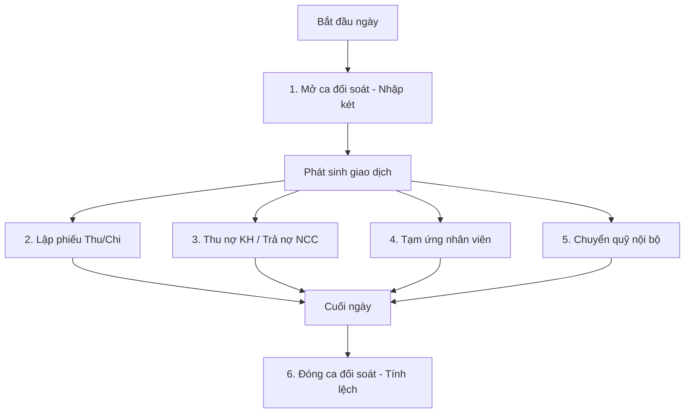

# Hướng Dẫn Vận Hành Sổ Quỹ & Dòng Tiền (Cashbook Playbook)

Tài liệu này hướng dẫn chi tiết 6 luồng nghiệp vụ cốt lõi của phân hệ Sổ quỹ & Dòng tiền trên hệ thống CRM/ERP Sảnh Long Vetco, bao gồm cơ chế kiểm soát an ninh (RLS), quy trình duyệt phiếu và đối soát ca.

---

## 1. MÔ HÌNH PHÂN QUYỀN & BẢO MẬT (RLS)

Để bảo vệ dòng tiền của doanh nghiệp, hệ thống áp dụng cơ chế cô lập dữ liệu cực kỳ nghiêm ngặt ở tầng cơ sở dữ liệu:

- **Giám đốc/CEO & Admin:** Có quyền xem toàn bộ dòng tiền toàn hệ thống và báo cáo phân tích tổng hợp.
- **Kế toán & Quản lý chi nhánh (Accountant & Branch Manager):**
  - Chỉ xem và tương tác với các quỹ tiền mặt (`cash_funds`), tài khoản ngân hàng (`bank_accounts`) và các giao dịch thuộc chi nhánh mà mình được gán.
  - Phân tách quyền rõ ràng: Chỉ tài khoản có quyền `cashbook.create_inflow` mới lập được phiếu thu, và `cashbook.create_outflow` mới lập được phiếu chi.
- **Thủ kho / Nhân viên bán hàng (Warehouse Keeper):**
  - Chỉ xem được các giao dịch tiền mặt phát sinh trong phiên ca làm việc do chính họ mở (`session_id`). Không thể xem tài khoản ngân hàng hoặc số dư của các ca khác.

---

## 2. 6 LUỒNG NGHIỆP VỤ CỐT LÕI

### Luồng 1: Mở & Đóng ca đối soát (Cashier Session Flow)

Bắt buộc đối với các nhân viên thao tác trực tiếp với két tiền mặt tại chi nhánh.

1. **Mở ca đầu ngày:**
   - Nhân viên truy cập tab **Phiên quỹ** > Chọn **Mở ca mới**.
   - Chọn quỹ tiền mặt cần mở (nếu chi nhánh có nhiều quỹ).
   - Đếm thực tế số tiền trong két và nhập vào ô **Tiền mặt đầu ca (₫)**.
   - Bấm **Bắt đầu mở ca** để kích hoạt ca làm việc. Mọi giao dịch tiền mặt phát sinh sau đó sẽ tự động gắn với ID ca này.

2. **Đóng ca đối soát cuối ngày:**
   - Truy cập trang Sổ quỹ > Bấm **Đóng ca**.
   - Đếm thực tế toàn bộ tiền mặt cuối ngày trong két và nhập vào ô **Tiền mặt thực tế đếm được (₫)**.
   - Hệ thống tự động tính toán số dư lý thuyết theo công thức: 
     $$\text{Số dư hệ thống} = \text{Số dư đầu ca} + \sum\text{Thu tiền mặt} - \sum\text{Chi tiền mặt}$$
   - **Xử lý chênh lệch (Variance):**
     - Nếu chênh lệch bằng 0: Ca đóng bình thường.
     - Nếu có chênh lệch (thừa/thiếu tiền mặt): Nhân viên bắt buộc phải nhập **Lý do chênh lệch**.
     - Hệ thống sẽ tự động tạo một bút toán điều chỉnh đối ứng (`THU-KHAC` nếu thừa tiền, `CHI-NCC` nếu thiếu tiền) có trạng thái `approved` để cân bằng quỹ tiền mặt ngay lập tức, đảm bảo số dư két thực tế khớp 100% với hệ thống.

---

### Luồng 2: Lập & Phê duyệt Phiếu Chi (Outflow & Approval Flow)

Quy trình kiểm soát chi tiêu trên hạn mức 10 triệu đồng:

1. **Lập phiếu chi:**
   - Kế toán hoặc Quản lý chi nhánh truy cập tab **Phiếu thu / chi** > Bấm chọn **Phiếu Chi tiền**.
   - Chọn hạng mục chi, nhập số tiền, ngày giao dịch (chỉ cho phép tối đa lùi 30 ngày, không được chọn tương lai) và tài khoản nguồn (quỹ/ngân hàng).
   - Đính kèm tệp ảnh hóa đơn/chứng từ (bắt buộc) và diễn giải nội dung chi tiết.
   - Bấm **Xác nhận lưu phiếu**.

2. **Cơ chế Duyệt & Chặn tự duyệt (Self-Approval Guard):**
   - **Nếu số tiền $\le$ 10.000.000 ₫:** Phiếu tự động chuyển trạng thái `approved` và cập nhật trực tiếp vào số dư tài khoản nguồn.
   - **Nếu số tiền $>$ 10.000.000 ₫:** Phiếu chi ở trạng thái **Chờ duyệt** (`pending_approval`). Số dư tài khoản nguồn chưa bị trừ.
   - **Quy tắc chặn tự duyệt:** RLS cấm người lập phiếu tự phê duyệt phiếu của chính mình. Nút **Phê duyệt** trên giao diện sẽ bị khóa và mờ đi đối với người lập.
   - Một người quản lý khác có đủ thẩm quyền phải đăng nhập, kiểm tra chứng từ đính kèm trên tab **Tổng quan** và click **Phê duyệt** để chính thức trừ tiền trong quỹ.

---

### Luồng 3: Thu công nợ khách hàng (Customer Debt Collection Flow)

Dành cho sales thu tiền mặt đi thị trường hoặc kế toán nhận chuyển khoản từ khách hàng.

1. Vào tab **Thu nợ / Chi NCC / Tạm ứng** > Chọn phân hệ **Thu công nợ KH**.
2. Chọn khách hàng trong danh sách. Hệ thống sẽ tự động truy vấn số dư nợ hiện tại từ view `customer_summary_view` hiển thị trực quan dưới dạng cảnh báo.
3. Nhập số tiền thu (bấm **Thu toàn bộ** để tự điền nhanh số dư nợ), ngày thu, hình thức (Tiền mặt/Chuyển khoản) và ghi chú.
4. Bấm **Xác nhận thu công nợ**. 
5. Hệ thống kích hoạt database trigger để tự động:
   - Tạo 1 bút toán thu (`inflow`) trạng thái `approved` trong sổ quỹ.
   - Trừ công nợ khách hàng tương ứng.
   - Cộng số dư tài khoản nhận tiền.

---

### Luồng 4: Thanh toán nhà cung cấp (Supplier Payment Flow)

1. Vào tab **Thu nợ / Chi NCC / Tạm ứng** > Chọn phân hệ **Thanh toán NCC**.
2. Chọn nhà cung cấp. Hệ thống hiển thị số công nợ phải trả hiện tại.
3. Điền số tiền thanh toán, hình thức thanh toán, số chứng từ ngân hàng (nếu có).
4. Bấm **Xác nhận thanh toán NCC**.
5. Hệ thống kích hoạt database trigger để tự động:
   - Tạo 1 bút toán chi (`outflow`) trạng thái `approved` trong sổ quỹ.
   - Giảm trừ công nợ phải trả của nhà cung cấp.
   - Khấu trừ số dư tài khoản chi tiền.

---

### Luồng 5: Tạm ứng nhân viên (Employee Advance Flow)

Sử dụng khi nhân viên tạm ứng tiền đi công tác hoặc mua sắm công cụ dụng cụ khẩn cấp.

1. Vào tab **Thu nợ / Chi NCC / Tạm ứng** > Chọn phân hệ **Tạm ứng NV**.
2. Chọn nhân viên tạm ứng.
3. Điền số tiền tạm ứng, ngày tạm ứng, hạn hoàn ứng và lý do tạm ứng chi tiết.
4. Bấm **Xác nhận tạm ứng**.
5. Hệ thống sẽ:
   - Tạo 1 bản ghi tạm ứng trong bảng `employee_advances`.
   - Sinh tự động 1 phiếu chi tiền mặt trạng thái `approved` (hoặc `pending_approval` nếu số tiền ứng > 10M) gắn với quỹ tiền mặt chi nhánh.

---

### Luồng 6: Chuyển quỹ nội bộ (Internal Transfer Flow)

Thực hiện khi rút tiền mặt nhập quỹ từ ngân hàng hoặc nộp tiền mặt từ két vào tài khoản ngân hàng.

1. Vào tab **Chuyển quỹ nội bộ**.
2. Chọn **Tài khoản nguồn** (Chuyển đi) và **Tài khoản nhận** (Chuyển đến), xác định rõ loại quỹ/ngân hàng.
3. Nhập số tiền cần chuyển và lý do. Bấm **Xác nhận chuyển quỹ**.
4. Hệ thống thực hiện một giao dịch nguyên tử (Atomic transaction):
   - Tạo bản ghi trong bảng `internal_transfers`.
   - Trigger database tự động sinh **2 bút toán đối ứng** trong sổ quỹ: 1 phiếu chi (`outflow`) ở tài khoản nguồn và 1 phiếu thu (`inflow`) ở tài khoản nhận.
   - Cập nhật đồng thời số dư của cả 2 tài khoản, đảm bảo tính toàn vẹn dữ liệu tuyệt đối (không bao giờ xảy ra tình trạng trừ tài khoản này mà chưa cộng tài khoản kia).

---

## Audit lại 2026-06-10 (re-audit bảo mật) — migration `20260627000000_cashbook_harden.sql`

Sau khi module hoàn thiện (S1–S4), audit lại toàn diện toàn vẹn/phân quyền/bảo mật/UX. Đã chứng minh exploit thật trên prod (trong transaction rollback) rồi vá.

### Lỗ hổng đã vá

| # | Mức | Vấn đề | Cách vá |
|---|-----|--------|---------|
| C1 | 🔴 Nghiêm trọng | `fn_apply_fund_delta(uuid,uuid,numeric)` (SECURITY DEFINER, cộng/trừ thẳng số dư quỹ) chưa REVOKE → mọi user đăng nhập gọi `rpc('fn_apply_fund_delta')` sửa số dư tùy ý, không để lại phiếu. **Đã chứng minh**: non-admin đẩy QUY-HCM 30.46M→31.24M. | `REVOKE ALL ... FROM PUBLIC, anon, authenticated` cho `fn_apply_fund_delta` + `fn_default_cash_fund` + `fn_default_bank_account`. Trigger vẫn chạy (Postgres không kiểm EXECUTE caller khi fire trigger). |
| C2 | 🔴 Cao | Ngưỡng duyệt 10tr chỉ chặn ở client → nhân viên INSERT thẳng phiếu chi `approved` số tiền bất kỳ qua API, né duyệt + cô lập chi nhánh. **Đã chứng minh**: non-admin chèn 50M approved + chèn chéo chi nhánh. | Tạo lại policy `cashbook_insert_staff`: non-admin KHÔNG được INSERT outflow `approved` khi amount > 10tr (phải `pending_approval`); + cô lập chi nhánh (quỹ/TK phải thuộc chi nhánh mình); + whitelist status. |
| C3 | 🔴 Cao | Policy INSERT có clause hở `flow_type='internal_transfer'` → mọi user active chèn dòng chuyển quỹ rác. | Bỏ clause khỏi `cashbook_insert_staff` (leg chuyển quỹ do trigger SECURITY DEFINER tạo, bypass RLS). |
| C4 | 🟠 Trung | Không có state machine; sửa amount/quỹ phiếu đã `approved` không re-balance → lệch số dư im lặng. | Trigger BEFORE UPDATE `fn_guard_cashbook_update`: chỉ cho chuyển trạng thái hợp lệ (draft→pending/approved/cancelled, pending→approved/cancelled/draft, approved→cancelled); khóa amount/loại/quỹ khi đã approved (sửa → hủy + tạo mới); cancelled là chung cuộc; tự đóng dấu `cancelled_at`. |

**Cơ chế then chốt**: trigger auto sinh phiếu (order/debt/supplier/advance/transfer) là SECURITY DEFINER owner=postgres, bảng `cashbook_transactions` KHÔNG bật FORCE RLS → các trigger này **bỏ qua RLS**. Nhờ vậy ràng buộc RLS mới CHỈ áp cho phiếu nhập tay từ client, luồng auto (kể cả chi NCC > 10tr) không bị ảnh hưởng — đã verify supplier_payment 20M vẫn ra phiếu `approved`.

### Đã xác nhận LÀNH MẠNH (không cần sửa)
- Self-approval guard (UPDATE WITH CHECK `created_by ≠ auth.uid()` khi đặt `approved`) hoạt động đúng.
- DELETE bị chặn (không có policy DELETE → 0 dòng).
- SELECT cô lập chi nhánh đúng (accountant/branch_manager theo chi nhánh; warehouse_keeper theo ca; sales chỉ phiếu mình).
- 0 phiếu thiếu, 0 lệch chuyển quỹ, 0 lệch công nợ NCC, sessions không lệch. 4 phiếu "mồ côi" (order_payment đã xóa) đều đã `cancelled` → số dư đã đảo, vô hại.

### ⚠️ Vấn đề DỮ LIỆU VẬN HÀNH cần user xử lý (không tự sửa)
- **Quỹ QUY-DN (Phù Mỹ) số dư = -580.000₫** — tiền mặt KHÔNG thể âm. Nguyên nhân: phiếu nộp quỹ cuối ca (`CHI-NOP-QUY` 1.150.000₫) vượt tổng tiền thực thu trong kỳ (~994.000₫). Cần kiểm tra lại nghiệp vụ đóng ca/nộp quỹ tại chi nhánh này và điều chỉnh bằng phiếu thu/chi lệch quỹ.

### Runbook đối soát (chạy định kỳ qua Supabase SQL Editor / Management API)
- **Số dư quỹ**: `balance − Σ(delta phiếu approved)` mỗi quỹ/TK = seed hằng số (số dư đầu kỳ nhập tay). Seed âm bất thường hoặc đổi giữa 2 lần đo = drift → điều tra.
- **Phiếu mồ côi**: cashbook có `source_table` nhưng source đã xóa → kiểm tra đã `cancelled` chưa.
- **Self-approval lịch sử**: `outflow > 10tr, approved, source_table IS NULL, created_by = approved_by`.
- **Lô vi phạm threshold**: đã bị RLS chặn từ 2026-06-10; query giám sát phòng hạng mục is_internal bị lạm dụng để né.

### Việc HOÃN (ghi nợ — không thuộc phạm vi bảo mật)
- Ngưỡng 10tr cấu hình hóa qua `system_settings` (hiện hardcode ở RLS + frontend `APPROVAL_THRESHOLD`).
- RPC tất toán tạm ứng NV `fn_settle_employee_advance` (hiện hoàn ứng tạo phiếu thu rời, `employee_advances.settled_amount` không tự cập nhật).
- RPC `fn_close_cashier_session` (đóng ca + nộp quỹ atomic, chặn nộp vượt tiền thực thu → tránh quỹ âm như QUY-DN).
