# BÁO CÁO AUDIT UX/UI: HỆ THỐNG CRMSANHLONG VÀ PHƯƠNG ÁN TỐI ƯU HÓA

**Tác giả:** Senior UX/UI Auditor & Solution Architect  
**Ngày thực hiện:** 26/05/2026  
**Dự án:** CRM/ERP Sanh Long Vetco  
**Mục tiêu:** Đánh giá trải nghiệm người dùng (UX/UI) trên hệ thống cũ (AppSheet/No-code) và thiết lập quy chuẩn thiết kế, luồng di chuyển tối ưu cho hệ thống React + Supabase mới.

---

## 1. ĐÁNH GIÁ TRẢI NGHIỆM BÁN HÀNG & THƯƠNG MẠI (Sales/Front-office UX)

### 1.1 Tốc độ lên đơn (Order Creation Speed)
*   **Pain Point trên AppSheet (No-code):** 
    AppSheet sử dụng luồng biểu mẫu phân cấp (Nested Form View). Để lên một đơn hàng có 3 sản phẩm, người bán phải trải qua luồng: *Nhấp nút Tạo đơn -> Chọn Khách hàng -> Nhấp nút "+ Thêm dòng sản phẩm" -> Mở Form chi tiết dòng -> Chọn sản phẩm -> Chọn đơn vị -> Nhập số lượng -> Nhấp Lưu dòng -> Quay lại Form cha -> Lặp lại bước "+ Thêm dòng" cho sản phẩm 2 và 3 -> Nhấp Lưu đơn hàng.* 
    *   **Số lượng clicks tối thiểu:** **14 - 18 clicks** cho một đơn hàng ngắn.
    *   **Hậu quả:** Tốc độ lên đơn cực chậm tại quầy khi đông khách. Người dùng phải liên tục chờ giao diện chuyển tiếp giữa các Form con.
*   **Giải pháp khắc phục trên hệ thống React:**
    *   Sử dụng **Giao diện POS 1 trang (Single-Page POS)** chia 3 cột (Giỏ hàng - Danh mục sản phẩm - Thanh toán).
    *   Cho phép tìm kiếm nhanh qua thanh Search autocomplete (phím tắt `F2`) hoặc click trực tiếp lên ảnh sản phẩm ở cột giữa để tự động thêm vào giỏ hàng.
    *   Nhập trực tiếp số lượng và đơn giá bán bằng bàn phím ngay tại dòng giỏ hàng mà không cần mở bất kỳ popup nào.
    *   **Số clicks giảm xuống:** **2 - 4 clicks** (nhanh gấp 5 lần).

### 1.2 Quét mã vạch/QR trên di động
*   **Pain Point trên AppSheet (No-code):** 
    Trường quét mã trên AppSheet (kiểu `Text` bật `Scan?`) phụ thuộc vào camera tích hợp của điện thoại qua Webview.
    *   **Hạn chế:** Tốc độ lấy nét chậm trong môi trường chuồng trại tối, ẩm ướt; dễ lỗi nếu mã vạch bị mờ hoặc bụi bẩn bám vào bao bì thuốc thú y. Camera liên tục bắt nét sai mục tiêu gây ức chế khi quét hàng loạt.
*   **Giải pháp khắc phục:**
    *   Tích hợp API quét mã chuyên nghiệp (như `ZXing` hoặc thư viện native của Capacitor/Cordova khi đóng gói mobile).
    *   Bật tính năng quét liên tục (Continuous Scan) cho phép nhân viên quét liên tục các sản phẩm vào giỏ hàng mà không cần phải tắt mở camera sau mỗi mã.

### 1.3 Quản lý thuộc tính đặc thù (Số lô, Hạn dùng, Bảng giá)
*   **Pain Point trên AppSheet (No-code):**
    *   Số lô (Batch/Lot) và hạn dùng của thuốc thú y thường được quản lý thủ công qua Enum dropdown dài dặc. Người bán phải cuộn tìm kiếm ngày hết hạn, rất dễ chọn nhầm giữa các lô tương đồng (ví dụ: Lô `2605A` hạn dùng 2027 vs Lô `2605B` hạn dùng 2028).
    *   AppSheet không tự động đề xuất lô hàng theo nguyên tắc **FEFO (Hàng cận hạn xuất trước)** tại giao diện người dùng, khiến nhân viên kho/bán hàng phải tự đối chiếu thủ công trên nhãn.
*   **Giải pháp khắc phục:**
    *   **Tự động hóa FEFO tại giỏ hàng:** Khi thêm sản phẩm, hệ thống (React + Supabase) tự động chọn lô cận hạn nhất còn hạn dùng và điền sẵn vào giỏ hàng.
    *   Hiển thị **Badge cảnh báo HSD trực quan** (Ví dụ: màu vàng cảnh báo cho lô < 90 ngày, màu đỏ cảnh báo cho lô < 30 ngày) ngay tại ô chọn số lô của dòng sản phẩm.
    *   **Hiển thị giá bán thông minh:** Tự động đối chiếu nhóm giá áp dụng của Khách hàng (Lẻ, Sỉ, Đại lý) với các bảng giá (`price_lists`) đã cài sẵn và áp dụng ngay lập tức khi chọn khách hàng, thay vì chiết khấu thủ công.

### 1.4 Tiện ích di động (Mobile native & Offline mode)
*   **Pain Point trên AppSheet (No-code):**
    AppSheet hỗ trợ Offline mode rất mạnh thông qua SQLite cục bộ, nhưng cơ chế đồng bộ (Sync Delay) lại gây ra điểm nghẽn nghiêm trọng.
    *   **Hạn chế:** Khi nhân viên đi thị trường ở vùng mạng yếu (3G chập chờn), AppSheet bắt buộc phải xếp hàng đợi (Sync Queue) để tải dữ liệu lên Google Sheets. Trong thời gian này, dữ liệu tồn kho thực tế bị lệch (Lô hàng A đã bán cho khách X nhưng hệ thống chưa sync kịp, nhân viên Y tại quầy vẫn thấy tồn và bán tiếp cho khách Z -> Trùng lặp đơn hàng, thiếu hụt kho).
*   **Giải pháp khắc phục:**
    *   Xây dựng cơ chế **PWA (Progressive Web App) kết hợp Service Worker (Workbox)** với chiến lược cache **NetworkFirst** cho API giao dịch và **CacheFirst** cho danh mục tĩnh.
    *   Nếu mất mạng hoàn toàn, đơn hàng được lưu vào `IndexedDB` dưới dạng **Đơn nháp (Draft Order)**. Khi có mạng trở lại, hệ thống sẽ chạy tiến trình ngầm tự động đẩy dữ liệu lên và kiểm tra xung đột tồn kho. Nếu lô hàng đã bị xuất trước đó, AI Agent sẽ đề xuất chuyển hướng sang lô hàng khác của cùng sản phẩm và gửi thông báo cho Sales xác nhận.

---

## 2. TRẢI NGHIỆM QUẢN TRỊ & VẬN HÀNH (Admin/Back-office UX)

### 2.1 Quản trị Kho & Kế toán (Data Table & Eye-tracking)
*   **Pain Point trên AppSheet (No-code):**
    *   Giao diện AppSheet mặc định có khoảng cách dòng (padding) và cỡ chữ rất lớn, dẫn đến hiện tượng **Dashboard Clutter** (rối loạn thông tin) khi hiển thị bảng dữ liệu kế toán lớn (ví dụ: sổ quỹ, tồn kho). Kế toán viên phải liên tục cuộn ngang và cuộn dọc để đối chiếu thông tin.
    *   Thiếu sự phân cấp thị giác (Visual Hierarchy): Tên cột, số tiền, trạng thái, mã đơn hàng đều có cùng một độ đậm nhạt và font chữ mặc định của hệ điều hành, gây mệt mỏi và dễ nhầm dòng khi làm việc 8 tiếng liên tục.
*   **Giải pháp khắc phục (Theo docs/02-LAYOUT-SPEC.md):**
    *   Sử dụng **Table dạng Dense (height 44px)** cho bộ phận Kế toán.
    *   Áp dụng font-variant `tabular-nums` cho tất cả cột số lượng, tiền tệ để các con số luôn thẳng hàng thẳng cột, giúp đối chiếu công nợ nhanh bằng mắt.
    *   Cố định cột đầu (Mã chứng từ) và cột cuối (Nút tác vụ) khi bảng bị tràn ngang.

### 2.2 Giám sát hạ tầng & Chi phí dự án (Poultry, Solar, Nodes)
*   **Pain Point trên AppSheet (No-code):**
    *   AppSheet chỉ hỗ trợ các dạng biểu đồ tròn/cột đơn giản từ Google Sheets. Không thể trực quan hóa các dữ liệu phức tạp như: so sánh lượng điện mặt trời tạo ra vs lượng điện tiêu thụ của trại gà, hoặc tính toán khấu hao chi phí node máy chủ AI theo thời gian thực để đưa ra chỉ số ROI chính xác.
*   **Giải pháp khắc phục:**
    *   Tích hợp thư viện biểu đồ chuyên sâu **Recharts** hoặc **D3.js** trên giao diện React.
    *   Thiết kế biểu đồ **AreaChart** hiển thị xu hướng thu chi chồng lấp, biểu đồ **Combo Chart** kết hợp đường và cột để so sánh chi phí vận hành (đường) vs lợi nhuận thực thu của đàn gà (cột).
    *   Hiển thị chỉ số ROI bằng các thẻ KPI cỡ lớn (`text-display` 32px Semibold) có so sánh tỷ lệ tăng trưởng so với tháng trước (% MoM) màu xanh lá/đỏ tinh tế.

### 2.3 Đồng bộ và Tự động hóa (AppSheet -> Google Sheets -> AI Agent)
*   **Pain Point trên AppSheet (No-code):**
    *   Dữ liệu đồng bộ trung gian qua Google Sheets trước khi vào AI Agent (NotebookLM RAG) thường bị trễ từ 15-30 phút.
    *   Người dùng Admin hoàn toàn bị mù thông tin (No Status Feedback): Họ không biết AI Agent đã "học" được dữ liệu đơn hàng/sản phẩm mới nhất chưa, hay tiến trình đang bị lỗi API Google.
*   **Giải pháp khắc phục:**
    *   Bỏ qua trung gian Google Sheets. Supabase PostgreSQL kích hoạt **Real-time Webhook** gọi trực tiếp sang Cloud Functions để cập nhật dữ liệu RAG/NotebookLM ngay khi đơn hàng được xác nhận.
    *   Hiển thị **System Status Banner** nhỏ trên Header hoặc trang cấu hình chỉ báo trạng thái học của AI: `[● AI Agent: Đã cập nhật 2 phút trước]` (màu xanh lá nhẹ) hoặc `[● AI Agent: Đang đồng bộ...]` (màu xanh dương xoay nhẹ).

---

## 3. ĐỀ XUẤT PHƯƠNG ÁN KHẮC PHỤC (UX/UI Action Plan)

### 3.1 Quy tắc thiết kế giảm mỏi mắt cho Admin (Quy chuẩn docs/02-LAYOUT-SPEC.md)

*   **Bảng màu (Color Palette):**
    *   Sử dụng màu chủ đạo **Warm-leaning Grayscale** (`#FAFBFC` cho background trang, `#FFFFFF` cho card) để làm dịu mắt.
    *   Một màu accent duy nhất: **Xanh dương trung `#1E5A9C`** cho các tương tác chính (button, active link, focus ring).
    *   Hạn chế tối đa việc tô màu nền đỏ/vàng/xanh lá cho các dòng hoặc ô. Thay vào đó, sử dụng **cột Trạng thái dạng Badge nhỏ viền xám nhẹ** kèm chấm tròn nhỏ phía trước (Ví dụ: `[● Đang hoạt động]`).
*   **Typography:**
    *   Font chữ: **`Be Vietnam Pro`** (Google Fonts) tải 3 weights: 400 (Regular), 500 (Medium), 600 (Semibold). Tránh dùng các font chữ mặc định Serif hoặc các font Sans-serif không tối ưu tiếng Việt bị lỗi nhảy dòng, lệch dấu.
*   **Khoảng cách & Radius:**
    *   Padding Card: `24px` cho desktop, `16px` cho di động.
    *   Bo góc: radius `10px` cho Card, `8px` cho nút nhấn mặc định, `6px` cho input để tạo sự mềm mại nhưng vẫn chuyên nghiệp.

### 3.2 Tối ưu hóa luồng di chuyển (User Flow Optimization)

Chúng ta tối ưu hóa luồng nghiệp vụ cốt lõi: **Khách mua hàng -> Xuất kho -> Thu tiền**

```mermaid
graph TD
    subgraph Luồng cũ - 8 bước
        A1[1. Tạo đơn hàng nháp] --> A2[2. Chọn khách hàng]
        A2 --> A3[3. Thêm sản phẩm thủ công]
        A3 --> A4[4. Chọn lô hàng thủ công]
        A4 --> A5[5. Lưu đơn & Chờ duyệt]
        A5 --> A6[6. Kế toán tạo phiếu xuất kho]
        A6 --> A7[7. Thủ kho xuất hàng thực tế]
        A7 --> A8[8. Lập phiếu thu tiền mặt/chuyển khoản]
    end

    subgraph Luồng tối ưu - 2 bước
        B1[1. Mở màn hình POS & Quét mã/Chọn hàng] --> B2[2. Nhấn 'Thanh toán' & Chọn phương thức]
        B2 --> B3[Hệ thống tự động chạy ngầm: Trừ kho FEFO + Sinh phiếu thu + Đổi trạng thái đơn]
    end
    
    style B1 fill:#EEF4FB,stroke:#1E5A9C,stroke-width:2px
    style B2 fill:#EEF4FB,stroke:#1E5A9C,stroke-width:2px
    style B3 fill:#2E7D5B,stroke:#2E7D5B,stroke-width:1px,color:#fff
```

*   **Kết quả:** Luồng nghiệp vụ giảm từ **8 bước xuống còn 2 bước** thao tác trực tiếp của con người. 6 bước thủ tục hành chính, đối soát kho và ghi nhận sổ quỹ được đóng gói tự động chạy ngầm (background transactions) trên hệ thống React + Supabase.

### 3.3 Mẹo tùy biến tối ưu cho giao diện AppSheet hiện tại (No-code Hacks)

Nếu bạn vẫn đang vận hành song song phiên bản AppSheet cũ và cần cải thiện trải nghiệm lập tức trước khi chuyển giao 100% sang hệ thống React, hãy áp dụng các mẹo sau:

1.  **Gộp Số Lô và Tên Sản phẩm bằng Virtual Column:**
    *   Tạo một cột ảo tên `[Sản phẩm hiển thị]` trong bảng chi tiết sản phẩm hoặc bảng dòng đơn hàng với công thức:
        `CONCATENATE([Tên SP], " - Lô: ", [Số Lô], " (HSD: ", TEXT([Hạn Sử Dụng], "DD/MM/YYYY"), ") [Tồn: ", [Số lượng tồn], "]")`
    *   Sử dụng cột ảo này làm nhãn hiển thị chính trong ô dropdown chọn sản phẩm. Người bán sẽ thấy đầy đủ thông tin lô/HSD/tồn kho ngay khi gõ tên sản phẩm, loại bỏ 100% nguy cơ nhầm lẫn.
2.  **Bỏ qua Form View bằng cách bật Quick Edit:**
    *   Trong cấu hình **Detail View** của Đơn hàng, hãy đưa cột `[Trạng thái]` hoặc các cột thông tin phụ vào mục **Quick Edit Columns**.
    *   Đối với bảng dòng sản phẩm, bật chế độ Quick Edit cho cột `[Số lượng]` và `[Đơn giá]`. Nhân viên có thể tăng giảm số lượng trực tiếp tại bảng danh sách Detail View bằng 1 click mà không cần phải nhấp vào dòng để mở Form con, tiết kiệm 3 clicks cho mỗi dòng sản phẩm.
3.  **Tối ưu hóa Giao diện Desktop bằng Detail View Side-by-Side:**
    *   Trong cấu hình của Detail View, đổi **Layout** thành **Side-by-side**. Trình duyệt trên máy tính sẽ hiển thị nhãn ở cột trái và giá trị ở cột phải một cách gọn gàng, giảm chiều cao cuộn trang đi 50%.
4.  **Sử dụng Format Rules để phân cấp thị giác:**
    *   Tạo một **Format Rule** cho trường số tiền công nợ hoặc số lượng cận hạn: Cho hiển thị text màu đỏ trầm (`#B23A3A`) và cỡ chữ `1.1` kèm icon cảnh báo `AlertTriangle` bên cạnh.
    *   Tạo Format Rule cho dòng tổng số tiền của đơn hàng: set định dạng chữ đậm (`Bold`) và màu text chính để kế toán dễ nhìn.
